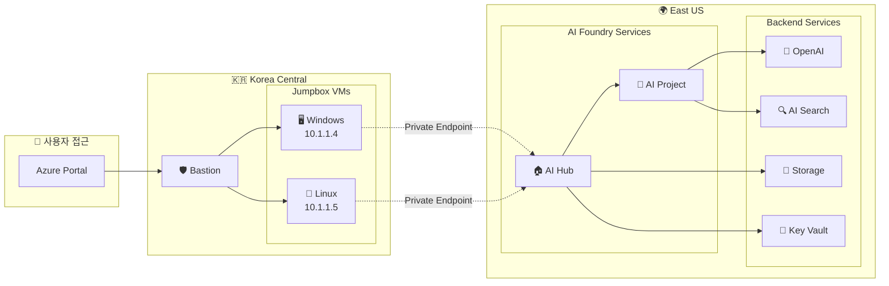
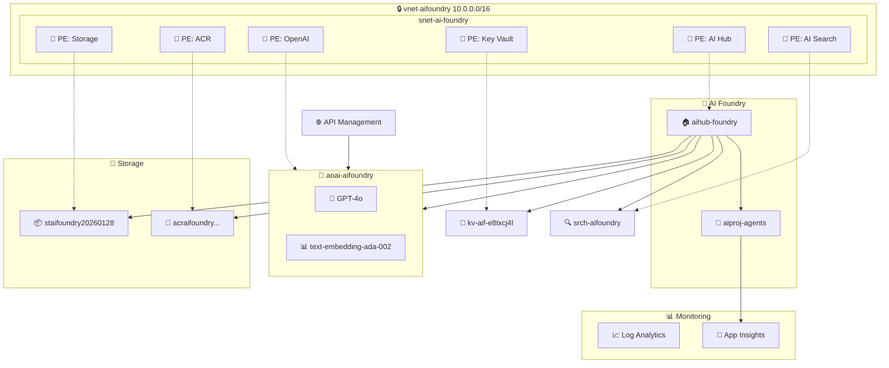
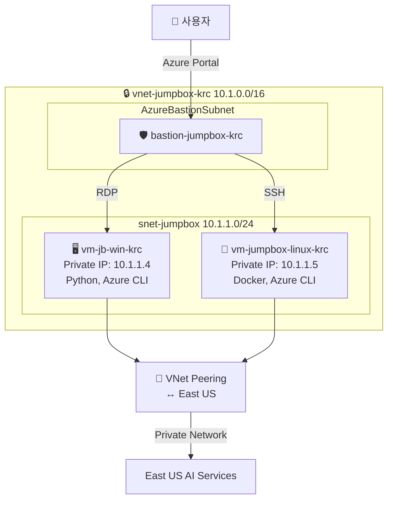
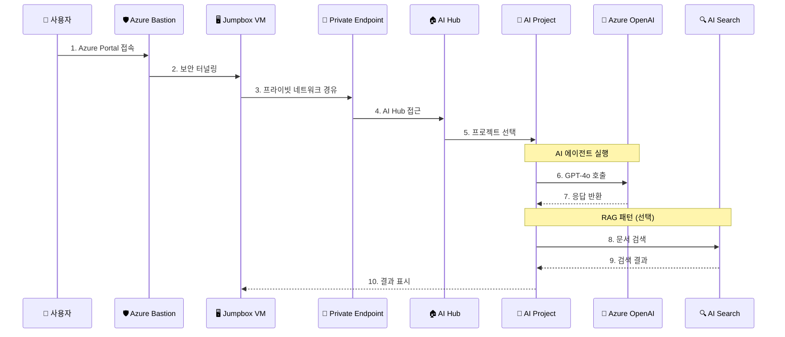
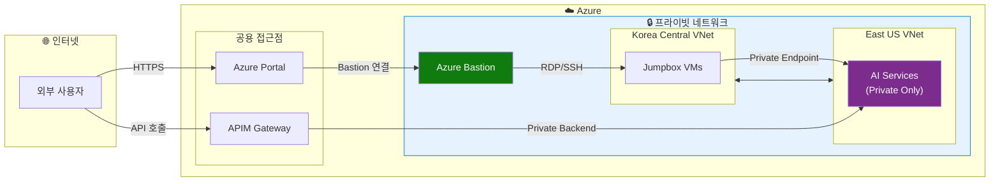

# AI Foundry Private Networking

Azure AI Foundry를 프라이빗 네트워크 환경에서 구성하기 위한 Terraform 기반 IaC(Infrastructure as Code) 프로젝트입니다.

## 개요

이 프로젝트는 Azure AI Foundry Hub와 Project를 프라이빗 엔드포인트를 통해 안전하게 배포하고, 관련 서비스들을 통합 관리하는 인프라를 제공합니다.

### 주요 기능

- Azure AI Foundry Hub/Project 프라이빗 배포
- Azure OpenAI 서비스 통합 (GPT-4o, text-embedding-ada-002)
- 프라이빗 엔드포인트 기반 네트워크 격리
- API Management를 통한 개발자 포털 제공
- 멀티 리전 구성 (East US + Korea Central)
- Jumpbox VM을 통한 안전한 접근
- Azure Bastion을 통한 보안 접속

## 아키텍처

### 리전 분리 구성

| 리전 | 리소스 |
|------|--------|
| **East US** | AI Foundry Hub/Project, Azure OpenAI, Storage, Key Vault, APIM, VNet |
| **Korea Central** | Jumpbox VMs (Windows/Linux), Bastion Host, VNet Peering |

### 인프라 다이어그램

#### 전체 아키텍처



#### East US 리전 상세



#### Korea Central 리전 상세



### 데이터 흐름도



### 네트워크 보안 구성



### 배포된 주요 리소스 (2026년 1월 28일 기준)

| 카테고리 | 리소스 | 이름/값 |
|----------|--------|---------|
| **리소스 그룹** | Resource Group | `rg-aifoundry-20260128` |
| **네트워크** | VNet (East US) | `vnet-aifoundry` (10.0.0.0/16) |
| | VNet (Korea Central) | `vnet-jumpbox-krc` (10.1.0.0/16) |
| **AI Foundry** | AI Hub | `aihub-foundry` |
| | AI Project | `aiproj-agents` |
| **Azure OpenAI** | OpenAI Account | `aoai-aifoundry` |
| | GPT-4o | `gpt-4o` (2024-11-20) |
| | Embedding | `text-embedding-ada-002` |
| **스토리지** | Storage Account | `staifoundry20260128` |
| | Container Registry | `acraifoundryb658f2ug` |
| **보안** | Key Vault | `kv-aif-e8txcj4l` |
| **Jumpbox** | Windows VM | Private IP: `10.1.1.4` |
| | Linux VM | Private IP: `10.1.1.5` |
| | Bastion | `bastion-jumpbox-krc` |

## 프로젝트 구조

```
.
├── infra/                       # Terraform 인프라 코드
│   ├── main.tf                  # 메인 구성
│   ├── variables.tf             # 변수 정의
│   ├── outputs.tf               # 출력 정의
│   ├── environments/            # 환경별 설정
│   │   ├── dev/                 # 개발 환경
│   │   └── prod/                # 프로덕션 환경
│   ├── modules/                 # Terraform 모듈
│   │   ├── networking/          # VNet, Subnet, NSG
│   │   ├── ai-foundry/          # AI Hub, Project
│   │   ├── storage/             # Storage, Container Registry
│   │   ├── security/            # Key Vault, RBAC
│   │   ├── monitoring/          # Application Insights
│   │   ├── cognitive-services/  # Azure OpenAI, AI Search
│   │   ├── jumpbox-krc/         # Jumpbox VMs (Korea Central)
│   │   └── apim/                # API Management
│   └── scripts/                 # 자동화 스크립트
├── src/                         # Python 소스 코드
│   └── visualize_infrastructure.py  # 인프라 시각화
└── docs/                        # 문서
    └── cost-estimation.md       # 비용 추정
```

## 시작하기

### 사전 요구사항

- [Terraform](https://www.terraform.io/) v1.12.1 이상
- [Azure CLI](https://docs.microsoft.com/cli/azure/) 최신 버전
- Azure 구독 및 적절한 권한
- [uv](https://github.com/astral-sh/uv) (Python 시각화용, 선택사항)

### 배포 방법

1. **Azure 로그인**
   ```bash
   az login
   az account set --subscription "<구독-ID>"
   ```

2. **Terraform 초기화**
   ```bash
   cd infra
   ./scripts/init-terraform.sh local
   ```

3. **배포 실행**
   ```bash
   ./scripts/deploy.sh
   ```

또는 수동으로:
```bash
terraform plan -var-file="environments/dev/terraform.tfvars"
terraform apply -var-file="environments/dev/terraform.tfvars" -auto-approve
```

### 인프라 시각화

Python diagrams 라이브러리를 사용하여 인프라 다이어그램을 생성할 수 있습니다:

```bash
cd src
uv run visualize_infrastructure.py
```

## 네트워크 구성

### 프라이빗 DNS 영역

| DNS 영역 | 용도 |
|----------|------|
| `privatelink.api.azureml.ms` | AI Foundry API |
| `privatelink.notebooks.azure.net` | Notebooks |
| `privatelink.blob.core.windows.net` | Blob Storage |
| `privatelink.file.core.windows.net` | File Storage |
| `privatelink.vaultcore.azure.net` | Key Vault |
| `privatelink.openai.azure.com` | Azure OpenAI |
| `privatelink.cognitiveservices.azure.com` | Cognitive Services |
| `privatelink.search.windows.net` | AI Search |
| `privatelink.azurecr.io` | Container Registry |

### Jumpbox 접근

Azure Bastion을 통해 안전하게 Jumpbox에 접근합니다:

1. Azure Portal에서 `bastion-jumpbox-krc` 선택
2. Windows VM (`10.1.1.4`) 또는 Linux VM (`10.1.1.5`) 선택
3. 자격 증명 입력 후 연결

## 비용

예상 월간 비용에 대한 자세한 내용은 [docs/cost-estimation.md](docs/cost-estimation.md)를 참조하세요.

| 시나리오 | 월별 예상 비용 |
|----------|---------------|
| 최소 (유휴 상태) | ~$1,000 |
| 일반 (개발 중) | ~$1,500 |
| 최대 (활발한 사용) | ~$3,600 |

## 라이선스

이 프로젝트는 MIT 라이선스 하에 배포됩니다. 자세한 내용은 [LICENSE](LICENSE) 파일을 참조하세요.

## 기여

버그 리포트, 기능 제안, Pull Request를 환영합니다.
