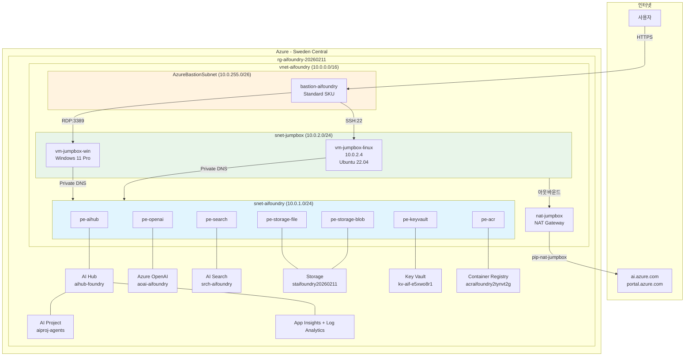
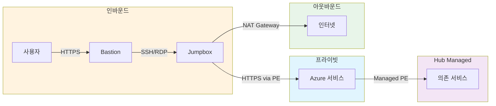

# AI Foundry Private Networking

Azure AI Foundry를 프라이빗 네트워크 환경에서 구성하기 위한 Terraform 기반 IaC(Infrastructure as Code) 프로젝트입니다.

## 개요

이 프로젝트는 Azure AI Foundry Hub와 Project를 **프라이빗 엔드포인트** 기반으로 안전하게 배포하고,
Azure Bastion + Jumpbox를 통해 프라이빗 네트워크 내에서 AI Foundry에 접근할 수 있는 인프라를 제공합니다.

### 주요 기능

- Azure AI Foundry Hub/Project 프라이빗 배포 (Managed Network + Private Endpoint)
- Azure OpenAI 서비스 통합 (GPT-4o, text-embedding-ada-002)
- 7개 Private Endpoint 기반 네트워크 격리
- 9개 Private DNS Zone을 통한 이름 해석
- Azure Bastion을 통한 보안 접속
- Linux Jumpbox VM (Python 개발 환경 자동 구성)
- Windows Jumpbox VM (Portal/GUI 접속 환경)
- NAT Gateway를 통한 Jumpbox 아웃바운드 인터넷 접근
- AAD(Managed Identity) 인증 기반 서비스 간 연결

## 아키텍처

### 배포 구성 (2026년 2월 11일 기준)

Sweden Central 단일 리전에 **Private Networking** 구성으로 배포되어 있습니다.

```
┌─────────────────────────────────────────────────────────────────────────────┐
│                      Sweden Central (단일 리전)                             │
│  rg-aifoundry-20260211                                                     │
│  ┌───────────────────────────────────────────────────────────────────────┐ │
│  │               vnet-aifoundry (10.0.0.0/16)                            │ │
│  │                                                                       │ │
│  │  ┌─────────────────────────────────────────────────────────────────┐ │ │
│  │  │  snet-aifoundry (10.0.1.0/24) - Private Endpoints 전용          │ │ │
│  │  │  pe-aihub, pe-storage-blob, pe-storage-file, pe-keyvault,       │ │ │
│  │  │  pe-openai, pe-search, pe-acr                                   │ │ │
│  │  └─────────────────────────────────────────────────────────────────┘ │ │
│  │  ┌─────────────────────────────────────────────────────────────────┐ │ │
│  │  │  snet-jumpbox (10.0.2.0/24) - Jumpbox VMs                       │ │ │
│  │  │  vm-jumpbox-linux (10.0.2.4) - Ubuntu 22.04 (CLI/개발)           │ │ │
│  │  │  vm-jumpbox-win             - Windows 11 Pro (Portal/GUI)        │ │ │
│  │  │  ── nat-jumpbox (NAT Gateway) ── pip-nat-jumpbox → 인터넷       │ │ │
│  │  └─────────────────────────────────────────────────────────────────┘ │ │
│  │  ┌─────────────────────────────────────────────────────────────────┐ │ │
│  │  │  AzureBastionSubnet (10.0.255.0/26) - Bastion Host 전용         │ │ │
│  │  │  bastion-aifoundry (Standard SKU, tunneling 지원)                │ │ │
│  │  └─────────────────────────────────────────────────────────────────┘ │ │
│  └───────────────────────────────────────────────────────────────────────┘ │
└─────────────────────────────────────────────────────────────────────────────┘
```

#### 인프라 구성도



## 트래픽 흐름 상세

이 인프라에서 발생하는 트래픽은 크게 3가지 유형으로 나뉩니다.

### 1. 인바운드 트래픽: 사용자 → Jumpbox (Bastion 경유)

사용자가 Jumpbox에 접속하는 유일한 경로입니다. Public IP가 없는 Jumpbox에 Azure Bastion을 통해 접근합니다.

```
[사용자 브라우저/CLI]
        │
        │ HTTPS (443) ── Azure Portal 또는 az network bastion 명령
        ▼
┌─────────────────────────────┐
│  Azure Bastion              │
│  bastion-aifoundry          │
│  pip-bastion (Public IP)    │
│  AzureBastionSubnet         │
│  (10.0.255.0/26)            │
└─────────────────────────────┘
        │                  │
    SSH (22)          RDP (3389)
    ▼                      ▼
┌──────────────┐  ┌──────────────┐
│ Linux VM     │  │ Windows VM   │
│ 10.0.2.4     │  │ vm-jumpbox-  │
│ vm-jumpbox-  │  │ win          │
│ linux        │  │              │
│ CLI/Python   │  │ Browser/GUI  │
└──────────────┘  └──────────────┘
```

| 구간 | 프로토콜 | 포트 | NSG 규칙 |
|------|---------|------|----------|
| 사용자 → Bastion | HTTPS | 443 | Azure 관리 (자동) |
| Bastion → Linux VM | TCP | 22 | `AllowSSHFromBastion` (nsg-jumpbox, priority 100) |
| Bastion → Windows VM | TCP | 3389 | `AllowRDPFromBastion` (nsg-jumpbox, priority 110) |

### 2. 프라이빗 트래픽: Jumpbox → Azure 서비스 (Private Endpoint 경유)

Jumpbox에서 AI Foundry, OpenAI 등 Azure 서비스에 접근하는 경로입니다. 모든 트래픽은 VNet 내부의 Private Endpoint를 통해 전달되며, 인터넷을 거치지 않습니다.

```
┌──────────────────────┐
│  Jumpbox VM          │
│  snet-jumpbox        │
│  (10.0.2.0/24)       │
└──────────────────────┘
        │
        │ HTTPS (443) - VNet 내부 트래픽
        │ Private DNS로 이름 해석
        │   예: aihub-foundry....api.azureml.ms
        │       → privatelink.api.azureml.ms
        │       → 10.0.1.x (Private Endpoint IP)
        ▼
┌──────────────────────────────────────────────────────────┐
│  snet-aifoundry (10.0.1.0/24) - Private Endpoints       │
│                                                          │
│  pe-aihub ─────────→ AI Hub (aihub-foundry)              │
│  pe-openai ────────→ Azure OpenAI (aoai-aifoundry)       │
│  pe-search ────────→ AI Search (srch-aifoundry-27y5yxhp) │
│  pe-storage-blob ──→ Storage Blob (staifoundry20260211)  │
│  pe-storage-file ──→ Storage File (staifoundry20260211)  │
│  pe-keyvault ──────→ Key Vault (kv-aif-e5xwo8r1)         │
│  pe-acr ───────────→ ACR (acraifoundry2tynvt2g)          │
└──────────────────────────────────────────────────────────┘
```

#### DNS 해석 흐름

```
Jumpbox가 aihub-foundry.api.azureml.ms 에 접근 시:

  1. VNet DNS → Private DNS Zone 조회
  2. privatelink.api.azureml.ms Zone에서 A 레코드 반환
  3. 10.0.1.x (pe-aihub의 NIC IP) 반환
  4. VNet 내부 라우팅으로 Private Endpoint에 도달
  5. Private Endpoint가 실제 서비스에 연결
```

| 대상 서비스 | Private DNS Zone | NSG 규칙 |
|------------|-------------------|----------|
| AI Hub / Project | `privatelink.api.azureml.ms`, `privatelink.notebooks.azure.net` | `AllowHTTPS` (nsg-aifoundry, priority 120) |
| Azure OpenAI | `privatelink.openai.azure.com` | 동일 |
| AI Search | `privatelink.search.windows.net` | 동일 |
| Storage Blob | `privatelink.blob.core.windows.net` | 동일 |
| Storage File | `privatelink.file.core.windows.net` | 동일 |
| Key Vault | `privatelink.vaultcore.azure.net` | 동일 |
| Container Registry | `privatelink.azurecr.io` | 동일 |

### 3. 아웃바운드 트래픽: Jumpbox → 인터넷 (NAT Gateway 경유)

Jumpbox에서 ai.azure.com, portal.azure.com 등 공용 웹사이트에 접속하거나 패키지를 설치할 때 사용되는 경로입니다.
서브넷의 `defaultOutboundAccess = false` 설정으로 기본 아웃바운드가 차단되어 있으므로, NAT Gateway를 통해서만 인터넷에 접근할 수 있습니다.

```
┌──────────────────────┐
│  Jumpbox VM          │
│  snet-jumpbox        │
│  (10.0.2.0/24)       │
└──────────────────────┘
        │
        │ 아웃바운드 트래픽
        ▼
┌──────────────────────┐
│  NAT Gateway         │
│  nat-jumpbox         │
│  pip-nat-jumpbox     │
│  (Static Public IP)  │
└──────────────────────┘
        │
        │ SNAT (Source NAT)
        ▼
┌──────────────────────┐
│  인터넷               │
│  - ai.azure.com      │
│  - portal.azure.com  │
│  - pypi.org          │
│  - github.com        │
│  - aka.ms            │
└──────────────────────┘
```

| 구간 | 방식 | NSG 규칙 |
|------|------|----------|
| Jumpbox → VNet | VNet 내부 | `AllowVNetOutbound` (nsg-jumpbox, priority 100) |
| Jumpbox → 인터넷 | NAT Gateway (SNAT) | `AllowInternet` (nsg-jumpbox, priority 200) |

### 4. Hub Managed Network 트래픽: AI Hub ↔ 의존 서비스

AI Hub는 자체 Managed Network(`AllowInternetOutbound` 모드)를 가지며, Hub의 컴퓨팅이 Storage, Key Vault, ACR 등에 접근할 때 Azure가 자동으로 관리하는 Private Endpoint를 통해 통신합니다.

```
┌──────────────────────────────────┐
│  AI Hub Managed Network          │
│  (AllowInternetOutbound 모드)     │
│                                  │
│  Hub Managed PE (자동 생성)       │
│  ├── → Storage Account           │
│  ├── → Key Vault                 │
│  ├── → Container Registry        │
│  └── → Azure OpenAI / AI Search  │
│        (Hub Connections 통해)     │
└──────────────────────────────────┘
```

> **참고**: `AllowInternetOutbound` 모드는 Hub 컴퓨팅의 아웃바운드 인터넷 접근을 허용하는 모드이며, 이 모드에서도 `publicNetworkAccess`는 `Disabled`로 강제됩니다. 즉, Hub에 대한 인바운드 접근은 반드시 사용자가 만든 Private Endpoint(pe-aihub)를 통해야 합니다.

### 트래픽 흐름 전체 요약



### 배포된 리소스 목록

| 카테고리 | 리소스 타입 | 리소스 이름 | 비고 |
|----------|------------|------------|------|
| **리소스 그룹** | Resource Group | `rg-aifoundry-20260211` | Sweden Central |
| **네트워킹** | Virtual Network | `vnet-aifoundry` | 10.0.0.0/16 |
| | Subnet (PE) | `snet-aifoundry` | 10.0.1.0/24 |
| | Subnet (Jumpbox) | `snet-jumpbox` | 10.0.2.0/24 |
| | Subnet (Bastion) | `AzureBastionSubnet` | 10.0.255.0/26 |
| | NSG | `nsg-aifoundry`, `nsg-jumpbox` | |
| **AI Foundry** | AI Hub | `aihub-foundry` | kind=Hub, Managed Network |
| | AI Project | `aiproj-agents` | kind=Project |
| **Azure OpenAI** | Cognitive Account | `aoai-aifoundry` | kind=OpenAI |
| | 모델 배포 | `gpt-4o` | 버전: 2024-11-20 |
| | 모델 배포 | `text-embedding-ada-002` | 임베딩 모델 |
| **검색** | AI Search | `srch-aifoundry-27y5yxhp` | Standard SKU |
| **스토리지** | Storage Account | `staifoundry20260211` | StorageV2 |
| | Container Registry | `acraifoundry2tynvt2g` | Premium SKU |
| **보안** | Key Vault | `kv-aif-e5xwo8r1` | |
| | Managed Identity | `id-aifoundry` | User Assigned |
| **모니터링** | Log Analytics | `log-aifoundry` | |
| | Application Insights | `appi-aifoundry` | |
| **NAT Gateway** | NAT Gateway | `nat-jumpbox` | Jumpbox 아웃바운드 인터넷 |
| | Public IP | `pip-nat-jumpbox` | NAT용 Static IP |
| **Jumpbox** | Linux VM | `vm-jumpbox-linux` | 10.0.2.4, Standard_D4s_v3 |
| | Windows VM | `vm-jumpbox-win` | Windows 11 Pro, Standard_D4s_v3 |
| | Bastion Host | `bastion-aifoundry` | Standard SKU |

### Private Endpoints

| Private Endpoint | 대상 리소스 | Sub Resource | 상태 |
|------------------|------------|:------------:|:----:|
| `pe-aihub` | AI Hub | amlworkspace | Approved |
| `pe-storage-blob` | Storage Account | blob | Approved |
| `pe-storage-file` | Storage Account | file | Approved |
| `pe-keyvault` | Key Vault | vault | Approved |
| `pe-openai` | Azure OpenAI | account | Approved |
| `pe-search` | AI Search | searchService | Approved |
| `pe-acr` | Container Registry | registry | Approved |

### 네트워크 접근 설정

| 리소스 | publicNetworkAccess | 접근 방식 |
|--------|:-------------------:|----------|
| AI Hub | `Disabled` (강제) | Private Endpoint + Managed Network |
| AI Project | `Disabled` (강제) | Hub의 Managed Network를 통해 접근 |
| Azure OpenAI | `Disabled` | Private Endpoint 전용 |
| AI Search | `Disabled` | Private Endpoint 전용 |
| Storage Account | `Disabled` | Private Endpoint 전용 |
| Key Vault | `Disabled` | Private Endpoint 전용 |
| Container Registry | `Disabled` | Private Endpoint 전용 |

### Private DNS Zones

| DNS Zone | 용도 |
|----------|------|
| `privatelink.api.azureml.ms` | AI Foundry Hub API |
| `privatelink.notebooks.azure.net` | AI Foundry Notebooks |
| `privatelink.blob.core.windows.net` | Storage Blob |
| `privatelink.file.core.windows.net` | Storage File Share |
| `privatelink.vaultcore.azure.net` | Key Vault |
| `privatelink.cognitiveservices.azure.com` | Cognitive Services |
| `privatelink.openai.azure.com` | Azure OpenAI |
| `privatelink.azurecr.io` | Container Registry |
| `privatelink.search.windows.net` | AI Search |

### Network Security Groups

#### nsg-aifoundry (Private Endpoints 서브넷)

| 우선순위 | 규칙 이름 | 방향 | 포트 | 소스 | 동작 |
|----------|----------|------|------|------|------|
| 120 | AllowHTTPS | Inbound | 443 | VirtualNetwork | Allow |
| 4096 | DenyAllInbound | Inbound | * | * | Deny |

#### nsg-jumpbox (Jumpbox 서브넷)

| 우선순위 | 규칙 이름 | 방향 | 포트 | 소스 | 동작 | 용도 |
|----------|----------|------|------|------|------|------|
| 100 | AllowSSHFromBastion | Inbound | 22 | 10.0.255.0/26 | Allow | Bastion → Linux SSH |
| 110 | AllowRDPFromBastion | Inbound | 3389 | 10.0.255.0/26 | Allow | Bastion → Windows RDP |
| 4095 | DenyAllInbound | Inbound | * | * | Deny | 기본 거부 |
| 100 | AllowVNetOutbound | Outbound | * | VNet | Allow | PE 접근 |
| 200 | AllowInternet | Outbound | * | Internet | Allow | NAT Gateway 경유 |

### 네트워크 보안 핵심 원칙

| 원칙 | 설명 |
|------|------|
| **Zero Trust** | 모든 서비스는 Private Endpoint를 통해서만 접근, 공용 엔드포인트 비활성화 |
| **최소 권한** | NSG에서 필요한 포트만 열고 기본 거부 |
| **Bastion 필수** | Jumpbox VM에 Public IP 없음, Azure Bastion만 접근 허용 |
| **AAD 인증** | 서비스 간 연결은 Managed Identity 기반 AAD 인증 |
| **아웃바운드 제어** | `default_outbound_access_enabled = false`, NAT Gateway를 통해서만 인터넷 접근 |

## 프로젝트 구조

```
.
├── infra/                          # Terraform 인프라 코드
│   ├── main.tf                     # 메인 구성 (모듈 호출)
│   ├── variables.tf                # 변수 정의
│   ├── outputs.tf                  # 출력 정의
│   ├── environments/
│   │   └── dev/
│   │       └── terraform.tfvars    # 개발 환경 변수
│   ├── modules/
│   │   ├── networking/             # VNet, Subnet, NSG, Private DNS Zones
│   │   ├── ai-foundry/             # AI Hub, Project, Connections, RBAC, Hub PE
│   │   ├── storage/                # Storage Account, ACR, Storage/ACR PE
│   │   ├── security/               # Key Vault, Managed Identity, KV PE
│   │   ├── monitoring/             # Application Insights, Log Analytics
│   │   ├── cognitive-services/     # Azure OpenAI, AI Search, OpenAI/Search PE
│   │   └── jumpbox/                # Linux/Windows VM, Azure Bastion, NAT Gateway
│   └── scripts/                    # 배포 자동화 스크립트
├── src/                            # Python 소스 코드
│   └── visualize/                  # 인프라 시각화
├── scripts/                        # 유틸리티 스크립트
└── docs/                           # 문서
```

## 시작하기

### 사전 요구사항

- [Terraform](https://www.terraform.io/) v1.5.0 이상
- [Azure CLI](https://docs.microsoft.com/cli/azure/) 최신 버전
- Azure 구독 및 적절한 권한 (Contributor, User Access Administrator)

### 배포

```bash
# 1. Azure 로그인
az login
az account set --subscription "<구독-ID>"

# 2. Terraform 초기화 및 배포
cd infra
terraform init
terraform plan -var-file=environments/dev/terraform.tfvars
terraform apply -var-file=environments/dev/terraform.tfvars -auto-approve
```

**예상 배포 시간**: 약 15-20분 (Bastion 배포에 약 8분 소요)

### Jumpbox 접속

#### Linux Jumpbox (SSH - CLI/개발 환경)

```bash
az network bastion ssh \
  --name bastion-aifoundry \
  --resource-group rg-aifoundry-20260211 \
  --target-resource-id $(az vm show -g rg-aifoundry-20260211 -n vm-jumpbox-linux --query id -o tsv) \
  --auth-type password \
  --username azureuser
```

설치된 환경: Python 3.11 + venv (`/opt/ai-dev-env`), Azure CLI, openai/azure-identity 패키지, git, jq, vim, tmux

#### Windows Jumpbox (RDP - Portal/GUI 환경)

```bash
az network bastion rdp \
  --name bastion-aifoundry \
  --resource-group rg-aifoundry-20260211 \
  --target-resource-id $(az vm show -g rg-aifoundry-20260211 -n vm-jumpbox-win --query id -o tsv)
```

또는 Azure Portal에서:
1. Azure Portal > `bastion-aifoundry` 선택
2. 대상 VM 선택 (`vm-jumpbox-linux` 또는 `vm-jumpbox-win`)
3. 자격 증명 입력 후 접속

Windows Jumpbox에서는 브라우저를 통해 **ai.azure.com** 포털에 직접 접근할 수 있습니다 (NAT Gateway 경유).

### AI Foundry 접근

Jumpbox에서 프라이빗 네트워크를 통해 AI Foundry에 접근합니다:

```bash
# Azure 로그인 (Jumpbox 내에서)
az login

# AI Foundry Hub 확인
az ml workspace show --name aihub-foundry --resource-group rg-aifoundry-20260211

# OpenAI 테스트 (Python)
python3 -c "
from openai import AzureOpenAI
from azure.identity import DefaultAzureCredential

credential = DefaultAzureCredential()
token = credential.get_token('https://cognitiveservices.azure.com/.default')

client = AzureOpenAI(
    azure_endpoint='https://aoai-aifoundry-ujtfr8xs.openai.azure.com/',
    azure_ad_token=token.token,
    api_version='2024-02-15-preview'
)

response = client.chat.completions.create(
    model='gpt-4o',
    messages=[{'role': 'user', 'content': 'Hello!'}]
)
print(response.choices[0].message.content)
"
```

## 문서

- **[배포 가이드](docs/deployment-guide.md)**: Terraform 배포 상세 절차
- **[Office 파일 RAG 가이드](docs/office-file-rag-guide.md)**: Office 파일 업로드 + AI Search + Playground 시나리오
- **[보안 모범 사례](docs/security-best-practices.md)**: 자격 증명 관리, SSH 키 인증, 네트워크 보안
- **[비용 추정](docs/cost-estimation.md)**: 리소스별 예상 비용 및 절감 방안
- **[AI Search RAG 가이드](docs/ai-search-rag-guide.md)**: RAG 패턴 구현 가이드
- **[Jumpbox 접속 문제 해결](docs/troubleshooting-ai-foundry-access.md)**: 네트워크 진단 및 문제 해결

## 라이선스

이 프로젝트는 MIT 라이선스 하에 배포됩니다. 자세한 내용은 [LICENSE](LICENSE) 파일을 참조하세요.
