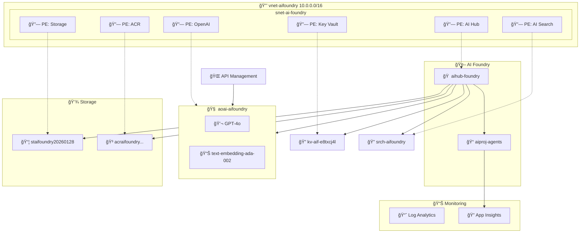

```mermaid
flowchart TB
    subgraph VNet["🔒 vnet-jumpbox-krc 10.1.0.0/16"]
        subgraph SubnetBastion["AzureBastionSubnet"]
            Bastion["ğŸ›¡ï¸ bastion-jumpbox-krc"]
        end
        subgraph SubnetJB["snet-jumpbox 10.1.1.0/24"]
            WinVM["ğŸ–¥ï¸ vm-jb-win-krc<br/>Private IP: 10.1.1.4<br/>Python, Azure CLI"]
            LinuxVM["🧠vm-jumpbox-linux-krc<br/>Private IP: 10.1.1.5<br/>Docker, Azure CLI"]
        end
    end

    Peering["🔄 VNet Peering<br/>↔ East US"]

    User["👤 사용ì"] --> |Azure Portal| Bastion
    Bastion --> |RDP| WinVM
    Bastion --> |SSH| LinuxVM
    WinVM & LinuxVM --> Peering
    Peering --> |Private Network| EUS["East US AI Services"]
```

# AI Foundry Private Networking

Azure AI Foundry를 프라이빗 네트워크 환경에서 구성하기 위한 Terraform 기반 IaC(Infrastructure as Code) 프로젝트입니다.

## 개요

이 프로젝트는 Azure AI Foundry Hub와 Project를 프라이빗 엔드포인트를 통해 안전하게 배포하고, 관련 서비스들을 통합 관리하는 인프라를 제공합니다.

### 주요 기능

- Azure AI Foundry Hub/Project 프라이빗 배포
- Azure OpenAI 서비스 통합 (GPT-4o, text-embedding-ada-002)
- 프라이빗 엔드포인트 기반 네트워크 격리
- API Management를 통한 개발자 포털 제공
- 멀티 리전 구성 (East US + Korea Central)
- Jumpbox VM을 통한 안전한 접근
- Azure Bastion을 통한 보안 접속

## 아키텍처

### 리전 분리 구성

| 리전 | 리소스 |
|------|--------|
| **East US** | AI Foundry Hub/Project, Azure OpenAI, Storage, Key Vault, APIM, VNet |
| **Korea Central** | Jumpbox VMs (Windows/Linux), Bastion Host, VNet Peering |

### 인프라 다이어그램

#### 전체 아키텍처


#### East US 리전 상세



#### Korea Central 리전 상세



### 데이터 흐름도



### 네트워크 보안 구성



### 배포된 주요 리소스 (2026년 1월 28일 기준)

| 카테고리 | 리소스 | 이름/값 |
|----------|--------|---------|
| **리소스 그룹** | Resource Group | `rg-aifoundry-20260128` |
| **네트워크** | VNet (East US) | `vnet-aifoundry` (10.0.0.0/16) |
| | VNet (Korea Central) | `vnet-jumpbox-krc` (10.1.0.0/16) |
| **AI Foundry** | AI Hub | `aihub-foundry` |
| | AI Project | `aiproj-agents` |
| **Azure OpenAI** | OpenAI Account | `aoai-aifoundry` |
| | GPT-4o | `gpt-4o` (2024-11-20) |
| | Embedding | `text-embedding-ada-002` |
| **스토리지** | Storage Account | `staifoundry20260128` |
| | Container Registry | `acraifoundryb658f2ug` |
| **보안** | Key Vault | `kv-aif-e8txcj4l` |
| **Jumpbox** | Windows VM | Private IP: `10.1.1.4` |
| | Linux VM | Private IP: `10.1.1.5` |
| | Bastion | `bastion-jumpbox-krc` |

## 프로젝트 구조

```
.
├── infra/                       # Terraform 인프라 코드
│   ├── main.tf                  # 메인 구성
│   ├── variables.tf             # 변수 정의
│   ├── outputs.tf               # 출력 정의
│   ├── environments/            # 환경별 설정
│   │   ├── dev/                 # 개발 환경
│   │   └── prod/                # 프로덕션 환경
│   ├── modules/                 # Terraform 모듈
│   │   ├── networking/          # VNet, Subnet, NSG
│   │   ├── ai-foundry/          # AI Hub, Project
│   │   ├── storage/             # Storage, Container Registry
│   │   ├── security/            # Key Vault, RBAC
│   │   ├── monitoring/          # Application Insights
│   │   ├── cognitive-services/  # Azure OpenAI, AI Search
│   │   ├── jumpbox-krc/         # Jumpbox VMs (Korea Central)
│   │   └── apim/                # API Management
│   └── scripts/                 # 자동화 스크립트
├── src/                         # Python 소스 코드
│   └── visualize_infrastructure.py  # 인프라 시각화
└── docs/                        # 문서
    └── cost-estimation.md       # 비용 추정
```

## 시작하기

### 사전 요구사항

- [Terraform](https://www.terraform.io/) v1.12.1 이상
- [Azure CLI](https://docs.microsoft.com/cli/azure/) 최신 버전
- Azure 구독 및 적절한 권한
- [uv](https://github.com/astral-sh/uv) (Python 시각화용, 선택사항)

### 배포 방법

1. **Azure 로그인**
   ```bash
   az login
   az account set --subscription "<구독-ID>"
   ```

2. **Terraform 초기화**
   ```bash
   cd infra
   ./scripts/init-terraform.sh local
   ```

3. **배포 실행**
   ```bash
   ./scripts/deploy.sh
   ```

또는 수동으로:
```bash
terraform plan -var-file="environments/dev/terraform.tfvars"
terraform apply -var-file="environments/dev/terraform.tfvars" -auto-approve
```

### 인프라 시각화

Python diagrams 라이브러리를 사용하여 인프라 다이어그램을 생성할 수 있습니다:

```bash
cd src
uv run visualize_infrastructure.py
```

## 네트워크 구성 상세

### 전체 네트워크 아키텍처

```mermaid
flowchart TB
    subgraph EUS["🌍 East US (메인 리전)"]
        subgraph VNet1["🔒 vnet-aifoundry<br/>10.0.0.0/16"]
            subgraph Subnet1["snet-aifoundry (10.0.1.0/24)<br/>Private Endpoints 전용"]
                PE1["🔗 pe-aihub<br/>→ AI Foundry Hub"]
                PE2["🔗 pe-storage-blob<br/>→ Storage Blob"]
                PE3["🔗 pe-storage-file<br/>→ Storage File"]
                PE4["🔗 pe-keyvault<br/>→ Key Vault"]
                PE5["🔗 pe-openai<br/>→ Azure OpenAI"]
                PE6["🔗 pe-search<br/>→ AI Search"]
                PE7["🔗 pe-acr<br/>→ Container Registry"]
                PE8["🔗 pe-apim<br/>→ API Management"]
            end
        end
    end

    subgraph KRC["🇰🇷 Korea Central (Jumpbox 리전)"]
        subgraph VNet2["🔒 vnet-jumpbox-krc<br/>10.1.0.0/16"]
            subgraph Subnet2["snet-jumpbox (10.1.1.0/24)<br/>Jumpbox VMs"]
                WinVM["🖥️ vm-jb-win-krc<br/>10.1.1.4<br/>Windows 11 Pro<br/>Python, VS Code, Git, Azure CLI"]
                LinuxVM["🐧 vm-jumpbox-linux-krc<br/>10.1.1.5<br/>Ubuntu 22.04<br/>Python, Docker, Azure CLI"]
            end
            subgraph BastionSubnet["AzureBastionSubnet<br/>10.1.255.0/26"]
                Bastion["🛡️ bastion-jumpbox-krc<br/>Public IP, Standard SKU"]
            end
        end
    end

    VNet1 <-->|"🔄 VNet Peering<br/>peer-main-to-jumpbox<br/>peer-jumpbox-to-main"| VNet2
    
    style EUS fill:#e6f2ff,stroke:#0078D4
    style KRC fill:#fff2e6,stroke:#FF6B35
    style Subnet1 fill:#f0e6ff,stroke:#7B2C8C
    style Subnet2 fill:#e6ffe6,stroke:#107C10
    style BastionSubnet fill:#ffe6e6,stroke:#D13438
```



### VNet 및 서브넷 구성

| VNet | 리전 | 주소 공간 | 용도 |
|------|------|-----------|------|
| `vnet-aifoundry` | East US | 10.0.0.0/16 | AI Foundry 및 관련 서비스 |
| `vnet-jumpbox-krc` | Korea Central | 10.1.0.0/16 | 개발자 Jumpbox 및 Bastion |

| 서브넷 | VNet | 주소 범위 | 가용 IP | 용도 |
|--------|------|-----------|---------|------|
| `snet-aifoundry` | vnet-aifoundry | 10.0.1.0/24 | 251개 | Private Endpoints |
| `snet-jumpbox` | vnet-jumpbox-krc | 10.1.1.0/24 | 251개 | Jumpbox VMs |
| `AzureBastionSubnet` | vnet-jumpbox-krc | 10.1.255.0/26 | 59개 | Azure Bastion (필수 이름) |

### Network Security Groups (NSG)

#### nsg-aifoundry (AI Foundry 서브넷)

| 우선순위 | 규칙 이름 | 방향 | 포트 | 소스 | 대상 | 동작 | 설명 |
|----------|----------|------|------|------|------|------|------|
| 100 | AllowAPIMManagement | Inbound | 3443 | ApiManagement | VirtualNetwork | Allow | APIM 관리 엔드포인트 |
| 110 | AllowAzureLoadBalancer | Inbound | 6390 | AzureLoadBalancer | VirtualNetwork | Allow | Azure LB Health Probe |
| 120 | AllowHTTPS | Inbound | 443 | VirtualNetwork | * | Allow | HTTPS 트래픽 |
| 130 | AllowAPIMGateway | Inbound | 443 | Internet | VirtualNetwork | Allow | APIM Gateway |
| 4096 | DenyAllInbound | Inbound | * | * | * | Deny | 기본 거부 |

#### nsg-jumpbox-krc (Jumpbox 서브넷)

| 우선순위 | 규칙 이름 | 방향 | 포트 | 소스 | 대상 | 동작 | 설명 |
|----------|----------|------|------|------|------|------|------|
| 100 | AllowRDPFromBastion | Inbound | 3389 | 10.1.255.0/26 | * | Allow | Bastion → Windows RDP |
| 110 | AllowSSHFromBastion | Inbound | 22 | 10.1.255.0/26 | * | Allow | Bastion → Linux SSH |
| 4096 | DenyAllInbound | Inbound | * | * | * | Deny | 기본 거부 |
| 100 | AllowEastUSVNet | Outbound | * | 10.1.0.0/16 | 10.0.0.0/16 | Allow | East US VNet 접근 |
| 200 | AllowInternet | Outbound | * | * | Internet | Allow | 패키지 설치용 |

### 프라이빗 DNS 영역

모든 Private DNS Zone은 **양쪽 VNet(East US, Korea Central)에 연결**되어 Jumpbox에서 프라이빗 엔드포인트로 DNS 해석이 가능합니다.

| DNS 영역 | 용도 | 연결된 리소스 |
|----------|------|--------------|
| `privatelink.api.azureml.ms` | AI Foundry Hub API | aihub-foundry |
| `privatelink.notebooks.azure.net` | AI Foundry Notebooks | aihub-foundry |
| `privatelink.blob.core.windows.net` | Blob Storage | staifoundry20260128 |
| `privatelink.file.core.windows.net` | File Storage | staifoundry20260128 |
| `privatelink.vaultcore.azure.net` | Key Vault | kv-aif-e8txcj4l |
| `privatelink.openai.azure.com` | Azure OpenAI | aoai-aifoundry |
| `privatelink.cognitiveservices.azure.com` | Cognitive Services | aoai-aifoundry |
| `privatelink.search.windows.net` | AI Search | srch-aifoundry-7kkykgt6 |
| `privatelink.azurecr.io` | Container Registry | acraifoundryb658f2ug |
| `privatelink.azure-api.net` | API Management | apim-aifoundry-zj85lf |

### VNet Peering 구성

```mermaid
flowchart LR
    subgraph EUS["vnet-aifoundry<br/>East US<br/>10.0.0.0/16"]
        EUS_Services["🔗 Private Endpoints<br/>AI Hub, OpenAI, Storage,<br/>Key Vault, AI Search, ACR"]
    end

    subgraph KRC["vnet-jumpbox-krc<br/>Korea Central<br/>10.1.0.0/16"]
        KRC_VMs["🖥️ Jumpbox VMs<br/>Windows, Linux"]
    end

    EUS -->|"peer-main-to-jumpbox<br/>✅ allow_forwarded_traffic<br/>❌ allow_gateway_transit"| KRC
    KRC -->|"peer-jumpbox-to-main<br/>✅ allow_forwarded_traffic<br/>❌ use_remote_gateways"| EUS

    style EUS fill:#e6f2ff,stroke:#0078D4
    style KRC fill:#fff2e6,stroke:#FF6B35
```



**VNet Peering 목적:**
- Korea Central의 Jumpbox에서 East US의 AI Foundry 리소스에 **프라이빗 접근**
- 양방향 peering으로 양쪽 VNet 간 통신 가능
- Private DNS Zone이 양쪽에 연결되어 DNS 해석 가능

### 트래픽 흐름

```mermaid
flowchart TB
    User["👤 User"]
    Portal["🌐 Azure Portal"]
    Bastion["🛡️ Azure Bastion<br/>bastion-jumpbox-krc"]
    
    subgraph JumpboxVMs["🖥️ Jumpbox VMs (Korea Central)"]
        WinVM["🪟 Windows VM<br/>10.1.1.4<br/>VS Code, Python, Azure CLI, Git"]
        LinuxVM["🐧 Linux VM<br/>10.1.1.5<br/>vim, Python, Azure CLI, Docker"]
    end
    
    Peering["🔄 VNet Peering"]
    
    subgraph PrivateEndpoints["🔗 Private Endpoints (10.0.1.x)"]
        PE_Hub["pe-aihub"]
        PE_OpenAI["pe-openai"]
        PE_Storage["pe-storage"]
        PE_KV["pe-keyvault"]
        PE_Search["pe-search"]
    end
    
    subgraph AzureServices["☁️ Azure Services (East US)"]
        AIHub["🏠 AI Hub"]
        OpenAI["🧠 OpenAI"]
        Storage["💾 Storage"]
        KeyVault["🔐 Key Vault"]
        AISearch["🔍 AI Search"]
    end

    User -->|"1️⃣ HTTPS"| Portal
    Portal -->|"2️⃣ Secure Tunnel"| Bastion
    Bastion -->|"3️⃣ RDP (3389)"| WinVM
    Bastion -->|"3️⃣ SSH (22)"| LinuxVM
    WinVM --> Peering
    LinuxVM --> Peering
    Peering --> PrivateEndpoints
    PE_Hub -->|"Private Link"| AIHub
    PE_OpenAI -->|"Private Link"| OpenAI
    PE_Storage -->|"Private Link"| Storage
    PE_KV -->|"Private Link"| KeyVault
    PE_Search -->|"Private Link"| AISearch

    style User fill:#fff,stroke:#333
    style Bastion fill:#107C10,color:#fff
    style Peering fill:#FFB900,stroke:#333
    style PrivateEndpoints fill:#f0e6ff,stroke:#7B2C8C
    style AzureServices fill:#e6f2ff,stroke:#0078D4
```



### 네트워크 보안 핵심 원칙

| 원칙 | 설명 | 구현 |
|------|------|------|
| **Zero Trust** | 모든 서비스는 Private Endpoint를 통해서만 접근 | 공용 엔드포인트 비활성화 |
| **최소 권한** | 필요한 포트만 열고 기본 거부 | NSG 규칙 최소화 |
| **Bastion 필수** | Jumpbox VM에 Public IP 없음 | Azure Bastion만 접근 허용 |
| **DNS 통합** | 양쪽 VNet에 모든 Private DNS Zone 연결 | VNet Link 10개 × 2 VNet |
| **아웃바운드 제어** | 기본 아웃바운드 차단 | `default_outbound_access_enabled = false` |

### Jumpbox 접근

Azure Bastion을 통해 안전하게 Jumpbox에 접근합니다:

1. Azure Portal에서 `bastion-jumpbox-krc` 선택
2. Windows VM (`10.1.1.4`) 또는 Linux VM (`10.1.1.5`) 선택
3. 자격 증명 입력 후 연결

## 비용

예상 월간 비용에 대한 자세한 내용은 [docs/cost-estimation.md](docs/cost-estimation.md)를 참조하세요.

| 시나리오 | 월별 예상 비용 |
|----------|---------------|
| 최소 (유휴 상태) | ~$1,175 |
| 일반 (개발 중) | ~$1,675 |
| 최대 (활발한 사용) | ~$3,800 |

> AI Search는 Private Endpoint 지원을 위해 Standard SKU를 사용합니다. Basic SKU로 변경 시 월 ~$171 절감 가능합니다.

## 라이선스

이 프로젝트는 MIT 라이선스 하에 배포됩니다. 자세한 내용은 [LICENSE](LICENSE) 파일을 참조하세요.

## 기여

버그 리포트, 기능 제안, Pull Request를 환영합니다.
