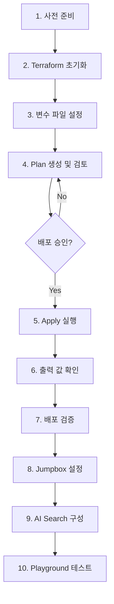

# Azure AI Foundry Private Networking 상세 배포 가이드

## 목차

1. [개요](#개요)
2. [사전 요구사항](#사전-요구사항)
3. [Terraform 명령어 상세 가이드](#terraform-명령어-상세-가이드)
4. [단계별 배포 절차](#단계별-배포-절차)
5. [선택적 구성 옵션](#선택적-구성-옵션)
6. [Private Networking 필수 설정](#private-networking-필수-설정)
7. [배포 후 검증](#배포-후-검증)
8. [트러블슈팅](#트러블슈팅)

---

## 개요

이 문서는 Azure AI Foundry를 프라이빗 네트워킹 환경에서 배포하기 위한 **상세한 Terraform 명령어 가이드**를 제공합니다. 모든 리소스 생성 단계와 선택적 구성 옵션을 명확하게 설명합니다.

### 배포되는 리소스

| 카테고리 | 리소스 | 필수/선택 |
|----------|--------|-----------|
| **네트워킹** | Virtual Network (East US) | 필수 |
| | Virtual Network (Korea Central) | 필수 |
| | VNet Peering | 필수 |
| | Network Security Groups | 필수 |
| | Private DNS Zones (10개) | 필수 |
| **AI Services** | AI Foundry Hub | 필수 |
| | AI Foundry Project | 필수 |
| | Azure OpenAI (GPT-4o, Embedding) | 필수 |
| | Azure AI Search | 필수 |
| **Storage** | Storage Account (Blob, File) | 필수 |
| | Container Registry | 필수 |
| **Security** | Key Vault | 필수 |
| | Managed Identity | 필수 |
| | Private Endpoints (8개) | 필수 |
| **Monitoring** | Application Insights | 필수 |
| | Log Analytics Workspace | 필수 |
| **Jumpbox** | Windows VM (Korea Central) | 필수 |
| | Linux VM (Korea Central) | 필수 |
| | Azure Bastion | 필수 |
| **API Management** | APIM 개발자 포털 | **선택** |

---

## 사전 요구사항

### 1. 필수 도구 설치

```bash
# Terraform 설치 (v1.12.1 이상)
wget https://releases.hashicorp.com/terraform/1.12.1/terraform_1.12.1_linux_amd64.zip
unzip terraform_1.12.1_linux_amd64.zip
sudo mv terraform /usr/local/bin/
terraform version

# Azure CLI 설치 (최신 버전)
curl -sL https://aka.ms/InstallAzureCLIDeb | sudo bash
az version

# jq 설치 (JSON 처리용)
sudo apt-get update && sudo apt-get install -y jq
```

### 2. Azure 인증

```bash
# Azure 로그인
az login

# 구독 설정
az account list --output table
az account set --subscription "<구독-ID-또는-이름>"

# 현재 구독 확인
az account show --output table
```

### 3. Azure 권한 확인

필요한 권한:
- **구독 수준**: `Contributor` 또는 `Owner`
- **리소스 그룹**: 생성 권한
- **역할 할당**: `User Access Administrator` (RBAC 설정용)

```bash
# 현재 사용자 권한 확인
az role assignment list --assignee $(az account show --query user.name -o tsv) --output table
```

---

## Terraform 명령어 상세 가이드

### 1. `terraform init` - 초기화

Terraform 작업 디렉토리를 초기화하고 필요한 프로바이더를 다운로드합니다.

```bash
cd infra

# 로컬 상태 파일 사용 (개발 환경)
terraform init

# 원격 백엔드 사용 (프로덕션 환경) - 선택
terraform init -backend-config="environments/dev/backend.tfvars"
```

**출력 예시:**
```
Initializing the backend...
Initializing provider plugins...
- Installing hashicorp/azurerm v3.117.1...
- Installing azure/azapi v1.15.0...
Terraform has been successfully initialized!
```

**주요 옵션:**
- `-backend=false`: 백엔드 초기화 건너뛰기
- `-upgrade`: 프로바이더 최신 버전으로 업그레이드
- `-reconfigure`: 백엔드 재구성

---

### 2. `terraform validate` - 구문 검증

Terraform 구성 파일의 구문을 검증합니다.

```bash
terraform validate
```

**출력 예시:**
```
Success! The configuration is valid.
```

**오류 예시:**
```
Error: Unsupported argument
  on main.tf line 45:
  45:   invalid_attribute = "value"
```

---

### 3. `terraform fmt` - 코드 포맷팅

Terraform 코드를 표준 형식으로 포맷팅합니다.

```bash
# 재귀적으로 모든 .tf 파일 포맷팅
terraform fmt -recursive

# 변경 사항만 확인 (실제 변경 없음)
terraform fmt -check -recursive
```

---

### 4. `terraform plan` - 실행 계획 생성

실제 변경 전에 어떤 리소스가 생성/수정/삭제될지 미리 확인합니다.

```bash
# 기본 plan (출력만)
terraform plan -var-file="environments/dev/terraform.tfvars"

# plan을 파일로 저장 (apply 시 사용)
terraform plan -var-file="environments/dev/terraform.tfvars" -out=tfplan

# 특정 리소스만 plan
terraform plan -target=module.networking
```

**출력 해석:**
- `+`: 새로 생성될 리소스
- `~`: 수정될 리소스
- `-`: 삭제될 리소스
- `->`: 리소스 재생성 (삭제 후 생성)

**예시:**
```
Terraform will perform the following actions:

  # azurerm_resource_group.main will be created
  + resource "azurerm_resource_group" "main" {
      + id       = (known after apply)
      + location = "eastus"
      + name     = "rg-aifoundry-20260203"
    }

Plan: 87 to add, 0 to change, 0 to destroy.
```

---

### 5. `terraform apply` - 인프라 배포

실행 계획을 적용하여 실제 Azure 리소스를 생성합니다.

```bash
# 대화형 배포 (yes 입력 필요)
terraform apply -var-file="environments/dev/terraform.tfvars"

# 자동 승인 (CI/CD용)
terraform apply -var-file="environments/dev/terraform.tfvars" -auto-approve

# 저장된 plan 파일 적용
terraform apply tfplan

# 특정 모듈만 배포
terraform apply -target=module.jumpbox_krc -auto-approve
```

**배포 시간:**
- **네트워킹 모듈**: 약 5-10분
- **AI Foundry 모듈**: 약 10-15분
- **APIM 모듈**: 약 30-45분 (선택 시)
- **전체 배포**: 약 40-60분 (APIM 포함 시 60-90분)

---

### 6. `terraform output` - 출력 값 확인

배포 완료 후 중요한 정보를 출력합니다.

```bash
# 모든 출력 값 표시
terraform output

# 특정 출력 값만 표시
terraform output ai_hub_name
terraform output -raw jumpbox_windows_private_ip

# JSON 형식으로 출력
terraform output -json
```

**출력 예시:**
```
ai_hub_name                = "aihub-foundry"
bastion_name               = "bastion-jumpbox-krc"
jumpbox_windows_private_ip = "10.1.1.4"
resource_group_name        = "rg-aifoundry-20260203"
```

---

### 7. `terraform destroy` - 리소스 삭제

배포된 모든 리소스를 삭제합니다.

```bash
# 대화형 삭제
terraform destroy -var-file="environments/dev/terraform.tfvars"

# 자동 승인
terraform destroy -var-file="environments/dev/terraform.tfvars" -auto-approve

# 특정 리소스만 삭제
terraform destroy -target=module.apim -auto-approve
```

⚠️ **주의**: 
- 삭제 전 중요한 데이터를 백업하세요
- Key Vault, OpenAI는 soft-delete로 30일간 보관됩니다
- Purge 필요 시: `az keyvault purge`, `az cognitiveservices account purge`

---

### 8. `terraform import` - 기존 리소스 가져오기

이미 존재하는 Azure 리소스를 Terraform 상태로 가져옵니다.

```bash
# 리소스 그룹 import
terraform import azurerm_resource_group.main /subscriptions/<subscription-id>/resourceGroups/rg-aifoundry-20260128

# VM import
terraform import 'module.jumpbox_krc.azurerm_windows_virtual_machine.jumpbox' \
  /subscriptions/<subscription-id>/resourceGroups/rg-aifoundry-20260128/providers/Microsoft.Compute/virtualMachines/vm-jb-win-krc
```

자동화 스크립트 사용:
```bash
./scripts/import-resources.sh
```

---

### 9. `terraform state` - 상태 관리

Terraform 상태 파일을 관리합니다.

```bash
# 모든 리소스 목록
terraform state list

# 특정 리소스 상세 정보
terraform state show azurerm_resource_group.main

# 리소스 이름 변경
terraform state mv azurerm_resource_group.old azurerm_resource_group.new

# 리소스 삭제 (실제 리소스는 유지)
terraform state rm module.apim
```

---

### 10. `terraform refresh` - 상태 동기화

실제 Azure 리소스와 Terraform 상태를 동기화합니다.

```bash
terraform refresh -var-file="environments/dev/terraform.tfvars"
```

---

## 단계별 배포 절차

### 전체 배포 프로세스



---

### Step 1: 프로젝트 클론 및 디렉토리 이동

```bash
# Git 클론
git clone https://github.com/dotnetpower/ai-foundry-private-networking.git
cd ai-foundry-private-networking/infra

# 디렉토리 구조 확인
tree -L 2
```

---

### Step 2: Terraform 초기화

```bash
# 프로바이더 다운로드 및 초기화
terraform init

# 출력 확인
# ✓ Terraform has been successfully initialized!
```

---

### Step 3: 환경 변수 파일 설정

```bash
# 개발 환경 변수 파일 확인
cat environments/dev/terraform.tfvars
```

**`terraform.tfvars` 예시:**
```hcl
# 기본 설정
location     = "eastus"
environment  = "dev"
project_name = "aifoundry"
deploy_date  = "20260203"  # 선택: 비어있으면 현재 날짜 사용

# 리소스 그룹 (선택)
resource_group_name = ""  # 비어있으면 자동 생성: rg-aifoundry-20260203

# 네트워크 설정
vnet_address_space = ["10.0.0.0/16"]
subnet_config = {
  ai_foundry_subnet = {
    address_prefix = "10.0.1.0/24"
    name           = "snet-aifoundry"
  }
  jumpbox_subnet = {  # 사용 안 함 (Korea Central 사용)
    address_prefix = "10.0.2.0/24"
    name           = "snet-jumpbox"
  }
}

# Jumpbox 설정
jumpbox_admin_username = "azureuser"
jumpbox_admin_password = "P@ssw0rd1234!"  # ⚠️ 강력한 비밀번호 사용

# APIM 설정 (선택)
publisher_email = "admin@example.com"
apim_sku_name   = "Developer_1"  # 선택: Developer_1 ($50/월) 또는 Basic_1 ($150/월)

# 태그
tags = {
  Environment = "dev"
  Project     = "AI Foundry Private Networking"
  ManagedBy   = "Terraform"
}
```

**민감 정보 관리:**
```bash
# 환경 변수로 비밀번호 설정 (권장)
export TF_VAR_jumpbox_admin_password="P@ssw0rd1234!"

# 또는 .tfvars 파일 분리
echo 'jumpbox_admin_password = "P@ssw0rd1234!"' > secret.tfvars
terraform plan -var-file="environments/dev/terraform.tfvars" -var-file="secret.tfvars"
```

---

### Step 4: Terraform Plan 생성

```bash
# Plan 생성 및 검토
terraform plan -var-file="environments/dev/terraform.tfvars" -out=tfplan

# 생성될 리소스 요약 확인
# Plan: 87 to add, 0 to change, 0 to destroy.
```

**주요 확인 사항:**
- ✅ Resource Group 이름 확인
- ✅ VNet 주소 공간 확인
- ✅ Private Endpoint 개수 확인 (8개)
- ✅ Jumpbox VM 설정 확인
- ✅ APIM 포함 여부 확인 (선택)

---

### Step 5: Terraform Apply 실행

```bash
# 배포 실행 (자동 승인)
terraform apply tfplan

# 또는 대화형 배포
terraform apply -var-file="environments/dev/terraform.tfvars"
```

**배포 진행 상황:**
```
module.networking.azurerm_virtual_network.main: Creating...
module.networking.azurerm_virtual_network.main: Creation complete after 5s

...

Apply complete! Resources: 87 added, 0 changed, 0 destroyed.

Outputs:

ai_hub_name = "aihub-foundry"
bastion_name = "bastion-jumpbox-krc"
resource_group_name = "rg-aifoundry-20260203"
```

**예상 배포 시간:**
- **APIM 제외**: 약 40-60분
- **APIM 포함**: 약 60-90분

---

### Step 6: 배포 출력 값 저장

```bash
# 모든 출력 값 저장
terraform output -json > outputs.json

# 주요 정보 추출
echo "Resource Group: $(terraform output -raw resource_group_name)"
echo "AI Hub: $(terraform output -raw ai_hub_name)"
echo "Bastion: $(terraform output -raw bastion_name)"
echo "Windows Jumpbox IP: $(terraform output -raw jumpbox_windows_private_ip)"
echo "Linux Jumpbox IP: $(terraform output -raw jumpbox_linux_private_ip)"
```

---

### Step 7: 배포 검증

```bash
# 리소스 그룹 확인
az group show --name $(terraform output -raw resource_group_name) --output table

# AI Hub 확인
az ml workspace show \
  --name $(terraform output -raw ai_hub_name) \
  --resource-group $(terraform output -raw resource_group_name) \
  --output table

# Jumpbox VM 상태 확인
az vm list \
  --resource-group $(terraform output -raw resource_group_name) \
  --output table
```

---

## 선택적 구성 옵션

### 1. API Management (APIM) - **선택**

APIM은 OpenAI API를 프록시하고 개발자 포털을 제공합니다.

**활성화 방법:**
```hcl
# terraform.tfvars
apim_sku_name = "Developer_1"  # 또는 "Basic_1"
publisher_email = "admin@example.com"
```

**비활성화 방법:**
```hcl
# main.tf에서 주석 처리
# module "apim" {
#   source = "./modules/apim"
#   ...
# }
```

**비용:**
- Developer_1: $50/월
- Basic_1: $150/월

**배포 시간:** 30-45분 추가

---

### 2. East US Jumpbox - **선택** (현재 비활성화)

Korea Central Jumpbox를 사용하므로 East US Jumpbox는 선택 사항입니다.

**활성화 방법:**
```hcl
# main.tf에서 주석 해제
module "jumpbox" {
  source = "./modules/jumpbox"
  
  resource_group_name = azurerm_resource_group.main.name
  location            = azurerm_resource_group.main.location
  subnet_id           = module.networking.jumpbox_subnet_id
  admin_username      = var.jumpbox_admin_username
  admin_password      = var.jumpbox_admin_password
  tags                = var.tags
}
```

---

### 3. VNet 주소 공간 - **선택**

기본값을 변경할 수 있습니다.

```hcl
# terraform.tfvars
vnet_address_space = ["10.0.0.0/16"]  # 기본값
# 또는
vnet_address_space = ["192.168.0.0/16"]  # 사용자 정의
```

---

### 4. Jumpbox VM 크기 - **선택**

```hcl
# modules/jumpbox-krc/variables.tf
variable "windows_vm_size" {
  default = "Standard_D4s_v3"  # 기본값 (4 vCPU, 16GB RAM)
  # 또는 "Standard_D2s_v3" (2 vCPU, 8GB RAM) - 비용 절감
}
```

---

### 5. AI Search SKU - **선택**

```hcl
# modules/cognitive-services/main.tf
sku  = "standard"  # 기본값 (Private Endpoint 지원)
# 또는 "basic" (비용 절감, Private Endpoint 미지원)
```

**비용 차이:**
- Standard: $250/월
- Basic: $79/월 (Private Endpoint 미지원)

---

## Private Networking 필수 설정

### 1. Public Network Access 비활성화 (필수)

모든 리소스는 공용 엔드포인트를 비활성화해야 합니다.

```hcl
# Storage Account
public_network_access_enabled = false

# Container Registry
public_network_access_enabled = false

# Key Vault
public_network_access_enabled = false

# Azure OpenAI
public_network_access_enabled = false

# AI Search
public_network_access_enabled = false
```

---

### 2. Private Endpoints 생성 (필수)

각 서비스마다 Private Endpoint를 생성해야 합니다.

| 서비스 | Private Endpoint | Sub-resource |
|--------|------------------|--------------|
| AI Hub | pe-aihub | amlworkspace |
| Storage | pe-storage-blob | blob |
| Storage | pe-storage-file | file |
| Key Vault | pe-keyvault | vault |
| OpenAI | pe-openai | account |
| AI Search | pe-search | searchService |
| ACR | pe-acr | registry |
| APIM | pe-apim | Gateway (선택) |

---

### 3. Private DNS Zones (필수)

Private Endpoint의 DNS 해석을 위해 Private DNS Zone을 생성하고 VNet에 연결합니다.

| DNS Zone | 연결 VNet |
|----------|-----------|
| privatelink.api.azureml.ms | East US + Korea Central |
| privatelink.notebooks.azure.net | East US + Korea Central |
| privatelink.blob.core.windows.net | East US + Korea Central |
| privatelink.file.core.windows.net | East US + Korea Central |
| privatelink.vaultcore.azure.net | East US + Korea Central |
| privatelink.openai.azure.com | East US + Korea Central |
| privatelink.cognitiveservices.azure.com | East US + Korea Central |
| privatelink.search.windows.net | East US + Korea Central |
| privatelink.azurecr.io | East US + Korea Central |
| privatelink.azure-api.net | East US + Korea Central (선택) |

**중요**: 양쪽 VNet(East US, Korea Central)에 **모든** Private DNS Zone을 연결해야 Jumpbox에서 DNS 해석이 가능합니다.

---

### 4. VNet Peering (필수)

Korea Central Jumpbox에서 East US AI 서비스에 접근하려면 VNet Peering이 필요합니다.

```hcl
# East US → Korea Central
resource "azurerm_virtual_network_peering" "main_to_jumpbox" {
  name                      = "peer-main-to-jumpbox"
  resource_group_name       = azurerm_resource_group.main.name
  virtual_network_name      = azurerm_virtual_network.main.name
  remote_virtual_network_id = azurerm_virtual_network.jumpbox_krc.id
  
  allow_forwarded_traffic   = true
  allow_gateway_transit     = false
}

# Korea Central → East US
resource "azurerm_virtual_network_peering" "jumpbox_to_main" {
  name                      = "peer-jumpbox-to-main"
  resource_group_name       = azurerm_resource_group.main.name
  virtual_network_name      = azurerm_virtual_network.jumpbox_krc.name
  remote_virtual_network_id = azurerm_virtual_network.main.id
  
  allow_forwarded_traffic   = true
  use_remote_gateways       = false
}
```

---

### 5. Network Security Groups (필수)

NSG를 사용하여 트래픽을 제어합니다.

**AI Foundry 서브넷 NSG:**
```hcl
# HTTPS 트래픽 허용
security_rule {
  name                       = "AllowHTTPS"
  priority                   = 120
  direction                  = "Inbound"
  access                     = "Allow"
  protocol                   = "Tcp"
  source_port_range          = "*"
  destination_port_range     = "443"
  source_address_prefix      = "VirtualNetwork"
  destination_address_prefix = "*"
}

# 기본 거부
security_rule {
  name                       = "DenyAllInbound"
  priority                   = 4096
  direction                  = "Inbound"
  access                     = "Deny"
  protocol                   = "*"
  source_port_range          = "*"
  destination_port_range     = "*"
  source_address_prefix      = "*"
  destination_address_prefix = "*"
}
```

**Jumpbox 서브넷 NSG:**
```hcl
# Bastion → RDP
security_rule {
  name                       = "AllowRDPFromBastion"
  priority                   = 100
  direction                  = "Inbound"
  access                     = "Allow"
  protocol                   = "Tcp"
  source_port_range          = "*"
  destination_port_range     = "3389"
  source_address_prefix      = "10.1.255.0/26"  # Bastion Subnet
  destination_address_prefix = "*"
}

# Bastion → SSH
security_rule {
  name                       = "AllowSSHFromBastion"
  priority                   = 110
  direction                  = "Inbound"
  access                     = "Allow"
  protocol                   = "Tcp"
  source_port_range          = "*"
  destination_port_range     = "22"
  source_address_prefix      = "10.1.255.0/26"
  destination_address_prefix = "*"
}

# East US VNet 접근
security_rule {
  name                       = "AllowEastUSVNet"
  priority                   = 100
  direction                  = "Outbound"
  access                     = "Allow"
  protocol                   = "*"
  source_port_range          = "*"
  destination_port_range     = "*"
  source_address_prefix      = "10.1.0.0/16"
  destination_address_prefix = "10.0.0.0/16"
}
```

---

### 6. Azure Bastion (필수)

Jumpbox에 Public IP를 부여하지 않고 안전하게 접속하기 위해 Azure Bastion을 사용합니다.

```hcl
resource "azurerm_bastion_host" "main" {
  name                = "bastion-jumpbox-krc"
  location            = "koreacentral"
  resource_group_name = azurerm_resource_group.main.name
  sku                 = "Standard"
  
  # Native Client 지원 (RDP/SSH)
  tunneling_enabled    = true
  ip_connect_enabled   = true
  
  ip_configuration {
    name                 = "bastion-ip-config"
    subnet_id            = azurerm_subnet.bastion.id
    public_ip_address_id = azurerm_public_ip.bastion.id
  }
}
```

**Bastion 서브넷 요구사항:**
- 이름: **AzureBastionSubnet** (필수 이름)
- 최소 크기: /26 (64개 IP)

---

### 7. Managed Identity 및 RBAC (필수)

서비스 간 인증을 위해 Managed Identity를 사용합니다.

```hcl
# AI Hub Managed Identity
identity {
  type = "SystemAssigned"
}

# Storage Blob Data Contributor 역할 할당
resource "azurerm_role_assignment" "hub_storage" {
  scope                = azurerm_storage_account.main.id
  role_definition_name = "Storage Blob Data Contributor"
  principal_id         = azurerm_machine_learning_workspace.hub.identity[0].principal_id
}

# Cognitive Services User 역할 할당
resource "azurerm_role_assignment" "hub_openai" {
  scope                = azurerm_cognitive_account.openai.id
  role_definition_name = "Cognitive Services User"
  principal_id         = azurerm_machine_learning_workspace.hub.identity[0].principal_id
}
```

---

### 8. Default Outbound Access 비활성화 (필수)

서브넷에서 기본 아웃바운드 인터넷 액세스를 비활성화합니다.

```hcl
resource "azurerm_subnet" "ai_foundry" {
  name                              = "snet-aifoundry"
  resource_group_name               = azurerm_resource_group.main.name
  virtual_network_name              = azurerm_virtual_network.main.name
  address_prefixes                  = ["10.0.1.0/24"]
  default_outbound_access_enabled   = false  # 필수
}
```

---

## 배포 후 검증

### 1. Jumpbox 접속 테스트

```bash
# Bastion을 통한 Windows Jumpbox 접속
az network bastion rdp \
  --name bastion-jumpbox-krc \
  --resource-group rg-aifoundry-20260203 \
  --target-resource-id $(az vm show -g rg-aifoundry-20260203 -n vm-jb-win-krc --query id -o tsv)

# 또는 Azure Portal에서:
# 1. VM → vm-jb-win-krc
# 2. Connect → Bastion
# 3. 자격 증명 입력 (azureuser / P@ssw0rd1234!)
```

---

### 2. Private Endpoint DNS 해석 확인

Jumpbox에서 실행:

```powershell
# Windows PowerShell
nslookup staifoundry20260203.blob.core.windows.net
# 예상 결과: 10.0.1.x (Private IP)

nslookup aihub-foundry.api.azureml.ms
# 예상 결과: 10.0.1.x (Private IP)
```

```bash
# Linux Bash
dig staifoundry20260203.blob.core.windows.net
dig aihub-foundry.api.azureml.ms
```

---

### 3. AI Foundry Portal 접속 테스트

Jumpbox 브라우저에서:
1. https://ai.azure.com 접속
2. Azure 계정 로그인
3. Hub 선택: `aihub-foundry`
4. Project 선택: `aiproj-agents`

---

### 4. Azure CLI 명령 테스트

```bash
# Storage Account 연결 테스트
az storage blob list \
  --account-name staifoundry20260203 \
  --container-name documents \
  --auth-mode login

# AI Hub 상태 확인
az ml workspace show \
  --name aihub-foundry \
  --resource-group rg-aifoundry-20260203
```

---

## 트러블슈팅

### 문제 1: Terraform 초기화 실패

**증상:**
```
Error: Failed to query available provider packages
```

**해결:**
```bash
# 프로바이더 캐시 삭제
rm -rf .terraform .terraform.lock.hcl

# 재초기화
terraform init
```

---

### 문제 2: RBAC 전파 지연

**증상:**
```
Error: authorization failed
```

**해결:**
```bash
# 30-60초 대기 후 재시도
sleep 60
terraform apply -auto-approve
```

---

### 문제 3: Private Endpoint DNS 해석 실패

**증상:**
Jumpbox에서 `nslookup`이 Private IP 대신 Public IP 반환

**해결:**
1. Private DNS Zone VNet Link 확인:
   ```bash
   az network private-dns link vnet list \
     --resource-group rg-aifoundry-20260203 \
     --zone-name privatelink.blob.core.windows.net
   ```

2. Korea Central VNet 연결 확인:
   ```bash
   # 양쪽 VNet 모두 연결되어야 함
   # - vnet-aifoundry (East US)
   # - vnet-jumpbox-krc (Korea Central)
   ```

3. VNet Peering 상태 확인:
   ```bash
   az network vnet peering list \
     --resource-group rg-aifoundry-20260203 \
     --vnet-name vnet-aifoundry \
     --output table
   ```

---

### 문제 4: AI Foundry Portal 접속 안 됨

**증상:**
Jumpbox에서 https://ai.azure.com 접속 시 로딩만 계속됨

**해결:**
1. NSG 규칙 확인:
   ```bash
   az network nsg rule list \
     --resource-group rg-aifoundry-20260203 \
     --nsg-name nsg-jumpbox-krc \
     --output table
   ```

2. 아웃바운드 인터넷 허용 확인:
   - 우선순위 200: AllowInternet (Outbound)

3. 브라우저 캐시 삭제 후 재접속

---

### 문제 5: APIM 배포 시간 초과

**증상:**
```
Error: timeout while waiting for state to become 'Succeeded'
```

**해결:**
```bash
# APIM은 30-45분 소요
# 배포 상태 확인
az apim show \
  --name apim-aifoundry-xxx \
  --resource-group rg-aifoundry-20260203 \
  --query provisioningState

# 배포 계속 진행 중이면 대기
# "Succeeded" 상태 확인 후 terraform refresh
terraform refresh -var-file="environments/dev/terraform.tfvars"
```

---

## 자동화 스크립트 사용

### 전체 배포 스크립트

```bash
cd infra
./scripts/deploy.sh
```

**스크립트 동작:**
1. Terraform 초기화
2. Plan 생성 및 검토
3. 사용자 확인 (yes 입력)
4. Apply 실행
5. 출력 값 표시

---

### 리소스 Import 스크립트

기존 Azure 리소스를 Terraform으로 관리하려면:

```bash
./scripts/import-resources.sh
```

---

### 검증 스크립트

배포 후 자동 검증:

```bash
./scripts/validate-terraform.sh
```

**검증 항목:**
- Resource Group 존재 여부
- AI Hub 상태
- Jumpbox VM 실행 상태
- Private Endpoint 연결 상태
- DNS Zone VNet Link 확인

---

## 관련 문서

- [README.md](../README.md) - 프로젝트 개요
- [AI Search RAG 가이드](./ai-search-rag-guide.md) - RAG 패턴 구현
- [Jumpbox 접속 가이드](./troubleshooting-ai-foundry-access.md) - Jumpbox 접속 및 문제 해결
- [보안 모범 사례](./security-best-practices.md) - 보안 설정
- [비용 추정](./cost-estimation.md) - 예상 비용

---

## 요약 체크리스트

### 배포 전 체크리스트

- [ ] Terraform 설치 (v1.12.1 이상)
- [ ] Azure CLI 설치
- [ ] Azure 로그인 및 구독 설정
- [ ] 적절한 Azure 권한 확인 (Contributor 또는 Owner)
- [ ] `terraform.tfvars` 파일 설정
- [ ] 강력한 Jumpbox 비밀번호 설정

### 배포 체크리스트

- [ ] `terraform init` 실행
- [ ] `terraform validate` 실행
- [ ] `terraform fmt -recursive` 실행
- [ ] `terraform plan` 검토
- [ ] `terraform apply` 실행
- [ ] 배포 출력 값 저장

### 배포 후 체크리스트

- [ ] Jumpbox 접속 테스트
- [ ] Private DNS 해석 확인
- [ ] AI Foundry Portal 접속
- [ ] Azure CLI 명령 테스트
- [ ] AI Search 인덱스 생성
- [ ] Playground에서 RAG 테스트

---

## 추가 리소스

- [Terraform 공식 문서](https://www.terraform.io/docs)
- [Azure Provider 문서](https://registry.terraform.io/providers/hashicorp/azurerm/latest/docs)
- [Azure AI Foundry 문서](https://learn.microsoft.com/azure/ai-studio/)
- [Azure Private Link 문서](https://learn.microsoft.com/azure/private-link/)
