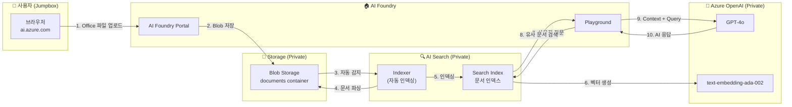

# Office 파일 업로드 및 RAG 패턴 구현 가이드

## 목차

1. [시나리오 개요](#시나리오-개요)
2. [아키텍처](#아키텍처)
3. [Private Networking 필수 설정](#private-networking-필수-설정)
4. [단계별 구현 가이드](#단계별-구현-가이드)
5. [Playground 테스트](#playground-테스트)
6. [CURL 예제 코드](#curl-예제-코드)
7. [트러블슈팅](#트러블슈팅)

---

## 시나리오 개요

### 사용자 시나리오

```
사용자 → AI Foundry Portal → Office 파일 업로드
         ↓
    Blob Storage 저장
         ↓
    AI Search 인덱싱
         ↓
    Playground에서 RAG 테스트
```

### 지원 파일 형식

| 파일 형식 | 확장자 | AI Search 지원 | 비고 |
|-----------|--------|----------------|------|
| **Word** | .docx, .doc | ✅ | 텍스트 추출 가능 |
| **Excel** | .xlsx, .xls | ✅ | 셀 데이터 추출 |
| **PowerPoint** | .pptx, .ppt | ✅ | 슬라이드 텍스트 추출 |
| **PDF** | .pdf | ✅ | 텍스트 및 이미지 추출 |
| **텍스트** | .txt, .md | ✅ | 직접 인덱싱 |
| **HTML** | .html, .htm | ✅ | HTML 파싱 |

---

## 아키텍처

### 전체 데이터 흐름



### Private Networking 아키텍처

```
┌─────────────────────────────────────────────────────────────────┐
│                    Korea Central (Jumpbox)                      │
│  ┌──────────────────────────────────────────────────────────┐  │
│  │  Jumpbox VM (10.1.1.x)                                   │  │
│  │  - 브라우저: https://ai.azure.com                        │  │
│  │  - Azure CLI: az storage blob upload                     │  │
│  └──────────────────────────────────────────────────────────┘  │
│                            │                                    │
│                    VNet Peering                                 │
│                            │                                    │
└────────────────────────────┼────────────────────────────────────┘
                             │
┌────────────────────────────┼────────────────────────────────────┐
│                            ▼                                    │
│                    East US (AI Services)                        │
│  ┌──────────────────────────────────────────────────────────┐  │
│  │  Private Endpoint Subnet (10.0.1.x)                      │  │
│  │                                                           │  │
│  │  ┌────────────┐  ┌────────────┐  ┌────────────┐         │  │
│  │  │ PE: Blob   │  │ PE: Search │  │ PE: OpenAI │         │  │
│  │  │ 10.0.1.4   │  │ 10.0.1.5   │  │ 10.0.1.6   │         │  │
│  │  └─────┬──────┘  └─────┬──────┘  └─────┬──────┘         │  │
│  └────────┼───────────────┼───────────────┼────────────────┘  │
│           │               │               │                    │
│  ┌────────▼──────┐ ┌──────▼─────┐ ┌──────▼──────┐            │
│  │ Blob Storage  │ │ AI Search  │ │ Azure OpenAI│            │
│  │ (Public: 禁止)│ │(Public: 禁止)│ │(Public: 禁止)│            │
│  └───────────────┘ └────────────┘ └─────────────┘            │
└─────────────────────────────────────────────────────────────────┘
```

---

## Private Networking 필수 설정

### 1. Storage Account 설정

#### 1.1 Public Network Access 비활성화

```hcl
# Terraform 설정
resource "azurerm_storage_account" "main" {
  name                          = "staifoundry20260203"
  resource_group_name           = azurerm_resource_group.main.name
  location                      = azurerm_resource_group.main.location
  account_tier                  = "Standard"
  account_replication_type      = "LRS"
  
  # 필수: Public Network Access 비활성화
  public_network_access_enabled = false
  
  # 필수: Default Network Action은 Deny
  network_rules {
    default_action = "Deny"
    bypass         = ["AzureServices"]
  }
}
```

#### 1.2 Private Endpoints 생성 (필수)

```hcl
# Blob Private Endpoint
resource "azurerm_private_endpoint" "storage_blob" {
  name                = "pe-storage-blob"
  location            = azurerm_resource_group.main.location
  resource_group_name = azurerm_resource_group.main.name
  subnet_id           = azurerm_subnet.ai_foundry.id

  private_service_connection {
    name                           = "psc-storage-blob"
    private_connection_resource_id = azurerm_storage_account.main.id
    subresource_names              = ["blob"]  # 필수: blob
    is_manual_connection           = false
  }

  private_dns_zone_group {
    name                 = "pdnszg-storage-blob"
    private_dns_zone_ids = [azurerm_private_dns_zone.blob.id]
  }
}

# File Private Endpoint (AI Foundry용)
resource "azurerm_private_endpoint" "storage_file" {
  name                = "pe-storage-file"
  location            = azurerm_resource_group.main.location
  resource_group_name = azurerm_resource_group.main.name
  subnet_id           = azurerm_subnet.ai_foundry.id

  private_service_connection {
    name                           = "psc-storage-file"
    private_connection_resource_id = azurerm_storage_account.main.id
    subresource_names              = ["file"]  # 필수: file
    is_manual_connection           = false
  }

  private_dns_zone_group {
    name                 = "pdnszg-storage-file"
    private_dns_zone_ids = [azurerm_private_dns_zone.file.id]
  }
}
```

#### 1.3 Private DNS Zones (필수)

```hcl
# Blob DNS Zone
resource "azurerm_private_dns_zone" "blob" {
  name                = "privatelink.blob.core.windows.net"
  resource_group_name = azurerm_resource_group.main.name
}

# East US VNet Link
resource "azurerm_private_dns_zone_virtual_network_link" "blob_eastus" {
  name                  = "link-blob-eastus"
  resource_group_name   = azurerm_resource_group.main.name
  private_dns_zone_name = azurerm_private_dns_zone.blob.name
  virtual_network_id    = azurerm_virtual_network.main.id
  registration_enabled  = false
}

# Korea Central VNet Link (필수!)
resource "azurerm_private_dns_zone_virtual_network_link" "blob_krc" {
  name                  = "link-blob-krc"
  resource_group_name   = azurerm_resource_group.main.name
  private_dns_zone_name = azurerm_private_dns_zone.blob.name
  virtual_network_id    = azurerm_virtual_network.jumpbox_krc.id
  registration_enabled  = false
}
```

**⚠️ 중요**: Korea Central VNet에도 모든 Private DNS Zone을 연결해야 Jumpbox에서 DNS 해석이 가능합니다.

---

### 2. AI Search 설정

#### 2.1 Public Network Access 비활성화

```hcl
resource "azurerm_search_service" "main" {
  name                = "srch-aifoundry-xxx"
  resource_group_name = azurerm_resource_group.main.name
  location            = azurerm_resource_group.main.location
  
  # 필수: Standard SKU 이상 (Private Endpoint 지원)
  sku  = "standard"
  
  # 필수: Public Network Access 비활성화
  public_network_access_enabled = false
}
```

**주의**: Basic SKU는 Private Endpoint를 지원하지 않습니다.

#### 2.2 Managed Identity 활성화

```hcl
resource "azurerm_search_service" "main" {
  # ...
  
  identity {
    type = "SystemAssigned"  # 필수
  }
}
```

#### 2.3 RBAC 권한 할당 (필수)

```hcl
# AI Search → Storage Blob Data Reader
resource "azurerm_role_assignment" "search_storage" {
  scope                = azurerm_storage_account.main.id
  role_definition_name = "Storage Blob Data Reader"
  principal_id         = azurerm_search_service.main.identity[0].principal_id
}
```

---

### 3. Azure OpenAI 설정

#### 3.1 Public Network Access 비활성화

```hcl
resource "azurerm_cognitive_account" "openai" {
  name                = "aoai-aifoundry"
  location            = azurerm_resource_group.main.location
  resource_group_name = azurerm_resource_group.main.name
  kind                = "OpenAI"
  sku_name            = "S0"
  
  # 필수: Custom Subdomain (Private Endpoint용)
  custom_subdomain_name = "aoai-aifoundry-xxx"
  
  # 필수: Public Network Access 비활성화
  public_network_access_enabled = false
  
  network_acls {
    default_action = "Deny"
  }
}
```

#### 3.2 Embedding 모델 배포 (필수)

```hcl
resource "azurerm_cognitive_deployment" "embedding" {
  name                 = "text-embedding-ada-002"
  cognitive_account_id = azurerm_cognitive_account.openai.id
  
  model {
    format  = "OpenAI"
    name    = "text-embedding-ada-002"
    version = "2"
  }
  
  scale {
    type = "Standard"
  }
}
```

**필수**: AI Search의 벡터 검색을 위해 embedding 모델이 필요합니다.

---

### 4. AI Foundry Hub 설정

#### 4.1 Hub Connections (필수)

```hcl
# Azure OpenAI Connection (AAD 인증)
resource "azapi_resource" "openai_connection" {
  type      = "Microsoft.MachineLearningServices/workspaces/connections@2024-04-01"
  name      = "aoai-connection"
  parent_id = azapi_resource.ai_hub.id

  body = jsonencode({
    properties = {
      category = "AzureOpenAI"
      target   = azurerm_cognitive_account.openai.endpoint
      authType = "AAD"  # 필수: Managed Identity 인증
      isSharedToAll = true
      metadata = {
        ApiType    = "azure"
        ApiVersion = "2024-10-21"
      }
    }
  })
}

# AI Search Connection (AAD 인증)
resource "azapi_resource" "search_connection" {
  type      = "Microsoft.MachineLearningServices/workspaces/connections@2024-04-01"
  name      = "aisearch-connection"
  parent_id = azapi_resource.ai_hub.id

  body = jsonencode({
    properties = {
      category = "CognitiveSearch"
      target   = "https://${azurerm_search_service.main.name}.search.windows.net"
      authType = "AAD"  # 필수: Managed Identity 인증
      isSharedToAll = true
    }
  })
}
```

#### 4.2 Hub Managed Identity RBAC (필수)

```hcl
# Hub MI → Storage Blob Data Contributor
resource "azurerm_role_assignment" "hub_storage" {
  scope                = azurerm_storage_account.main.id
  role_definition_name = "Storage Blob Data Contributor"
  principal_id         = azapi_resource.ai_hub.identity[0].principal_id
}

# Hub MI → Cognitive Services User
resource "azurerm_role_assignment" "hub_openai" {
  scope                = azurerm_cognitive_account.openai.id
  role_definition_name = "Cognitive Services User"
  principal_id         = azapi_resource.ai_hub.identity[0].principal_id
}

# Hub MI → Search Index Data Reader
resource "azurerm_role_assignment" "hub_search" {
  scope                = azurerm_search_service.main.id
  role_definition_name = "Search Index Data Reader"
  principal_id         = azapi_resource.ai_hub.identity[0].principal_id
}
```

---

### 5. VNet Peering 설정 (필수)

```hcl
# East US VNet → Korea Central VNet
resource "azurerm_virtual_network_peering" "main_to_jumpbox" {
  name                      = "peer-main-to-jumpbox"
  resource_group_name       = azurerm_resource_group.main.name
  virtual_network_name      = azurerm_virtual_network.main.name
  remote_virtual_network_id = azurerm_virtual_network.jumpbox_krc.id
  
  allow_forwarded_traffic   = true
  allow_gateway_transit     = false
}

# Korea Central VNet → East US VNet
resource "azurerm_virtual_network_peering" "jumpbox_to_main" {
  name                      = "peer-jumpbox-to-main"
  resource_group_name       = azurerm_resource_group.main.name
  virtual_network_name      = azurerm_virtual_network.jumpbox_krc.name
  remote_virtual_network_id = azurerm_virtual_network.main.id
  
  allow_forwarded_traffic   = true
  use_remote_gateways       = false
}
```

**필수**: 양방향 peering이 모두 설정되어야 합니다.

---

## 단계별 구현 가이드

### Step 1: Jumpbox 접속

#### Azure Portal 방식

1. Azure Portal 접속: https://portal.azure.com
2. 가상 머신 → `vm-jb-win-krc` 선택
3. **연결** → **Bastion** 선택
4. 사용자 이름: `azureuser`
5. 비밀번호 입력
6. **연결** 클릭

#### Azure CLI 방식

```bash
# Windows RDP
az network bastion rdp \
  --name bastion-jumpbox-krc \
  --resource-group rg-aifoundry-20260203 \
  --target-resource-id $(az vm show \
    -g rg-aifoundry-20260203 \
    -n vm-jb-win-krc \
    --query id -o tsv)

# Linux SSH
az network bastion ssh \
  --name bastion-jumpbox-krc \
  --resource-group rg-aifoundry-20260203 \
  --target-resource-id $(az vm show \
    -g rg-aifoundry-20260203 \
    -n vm-jumpbox-linux-krc \
    --query id -o tsv) \
  --auth-type password \
  --username azureuser
```

---

### Step 2: AI Foundry Portal 접속

Jumpbox 브라우저에서:

1. https://ai.azure.com 접속
2. Azure 계정 로그인
3. Hub 선택: `aihub-foundry`
4. Project 선택: `aiproj-agents`

**확인 사항:**
- ✅ Private Endpoint를 통한 접속인지 확인 (빠른 로딩)
- ✅ Hub와 Project가 정상적으로 표시되는지 확인

---

### Step 3: Storage Container 생성

#### Azure Portal 방식

Jumpbox에서:
1. Azure Portal → Storage accounts
2. `staifoundry20260203` 선택
3. **Containers** → **+ Container**
4. 이름: `documents`
5. Public access level: **Private (no anonymous access)**
6. **Create**

#### Azure CLI 방식

```bash
az storage container create \
  --name documents \
  --account-name staifoundry20260203 \
  --auth-mode login
```

---

### Step 4: AI Search 인덱스 생성

#### 스크립트 실행 (권장)

```bash
# Bash
cd ~/ai-foundry-examples
./search-test.sh

# PowerShell
cd $HOME\ai-foundry-examples
.\search-test.ps1
```

#### 수동 생성 (Azure Portal)

1. Azure Portal → AI Search services
2. `srch-aifoundry-xxx` 선택
3. **Search management** → **Indexes**
4. **+ Add index**
5. Index name: `aifoundry-docs-index`
6. Fields 추가:
   - `id` (Edm.String, Key, Filterable)
   - `content` (Edm.String, Searchable, Analyzer: ko.microsoft)
   - `title` (Edm.String, Searchable, Filterable, Sortable)
   - `metadata_storage_name` (Edm.String, Searchable, Filterable)
   - `metadata_storage_path` (Edm.String, Filterable)

#### Azure CLI 방식

```bash
# 인덱스 스키마
cat > index-schema.json << 'EOF'
{
  "name": "aifoundry-docs-index",
  "fields": [
    {"name": "id", "type": "Edm.String", "key": true, "filterable": true},
    {"name": "content", "type": "Edm.String", "searchable": true, "analyzer": "ko.microsoft"},
    {"name": "title", "type": "Edm.String", "searchable": true, "filterable": true, "sortable": true},
    {"name": "metadata_storage_name", "type": "Edm.String", "searchable": true, "filterable": true},
    {"name": "metadata_storage_path", "type": "Edm.String", "filterable": true}
  ]
}
EOF

# 인덱스 생성
az rest \
  --method PUT \
  --url "https://srch-aifoundry-xxx.search.windows.net/indexes/aifoundry-docs-index?api-version=2024-07-01" \
  --headers "Content-Type=application/json" \
  --body @index-schema.json \
  --resource "https://search.azure.com"
```

---

### Step 5: Data Source 및 Indexer 생성

#### Data Source 생성

```bash
# Storage Resource ID 가져오기
STORAGE_RESOURCE_ID=$(az storage account show \
  --name staifoundry20260203 \
  --resource-group rg-aifoundry-20260203 \
  --query id -o tsv)

# Data Source 스키마
cat > datasource-schema.json << EOF
{
  "name": "aifoundry-blob-datasource",
  "type": "azureblob",
  "credentials": {
    "connectionString": "ResourceId=$STORAGE_RESOURCE_ID;"
  },
  "container": {
    "name": "documents"
  },
  "dataChangeDetectionPolicy": {
    "@odata.type": "#Microsoft.Azure.Search.HighWaterMarkChangeDetectionPolicy",
    "highWaterMarkColumnName": "_ts"
  }
}
EOF

# Data Source 생성
az rest \
  --method PUT \
  --url "https://srch-aifoundry-xxx.search.windows.net/datasources/aifoundry-blob-datasource?api-version=2024-07-01" \
  --headers "Content-Type=application/json" \
  --body @datasource-schema.json \
  --resource "https://search.azure.com"
```

#### Indexer 생성

```bash
# Indexer 스키마
cat > indexer-schema.json << 'EOF'
{
  "name": "aifoundry-docs-indexer",
  "dataSourceName": "aifoundry-blob-datasource",
  "targetIndexName": "aifoundry-docs-index",
  "schedule": {
    "interval": "PT2H"
  },
  "parameters": {
    "configuration": {
      "parsingMode": "text",
      "dataToExtract": "contentAndMetadata"
    }
  },
  "fieldMappings": [
    {
      "sourceFieldName": "metadata_storage_name",
      "targetFieldName": "title"
    }
  ]
}
EOF

# Indexer 생성
az rest \
  --method PUT \
  --url "https://srch-aifoundry-xxx.search.windows.net/indexers/aifoundry-docs-indexer?api-version=2024-07-01" \
  --headers "Content-Type=application/json" \
  --body @indexer-schema.json \
  --resource "https://search.azure.com"
```

---

### Step 6: Office 파일 업로드

#### Azure Portal 방식

1. Azure Portal → Storage accounts → `staifoundry20260203`
2. Containers → `documents`
3. **Upload**
4. Office 파일 선택 (.docx, .pptx, .xlsx, .pdf 등)
5. **Upload**

#### Azure CLI 방식

```bash
# 단일 파일 업로드
az storage blob upload \
  --account-name staifoundry20260203 \
  --container-name documents \
  --name "AI_Foundry_소개.docx" \
  --file "./AI_Foundry_소개.docx" \
  --auth-mode login

# 여러 파일 일괄 업로드
az storage blob upload-batch \
  --account-name staifoundry20260203 \
  --destination documents \
  --source "./office_files/" \
  --auth-mode login
```

#### PowerShell 방식

```powershell
# 단일 파일 업로드
az storage blob upload `
  --account-name staifoundry20260203 `
  --container-name documents `
  --name "AI_Foundry_소개.docx" `
  --file "C:\Files\AI_Foundry_소개.docx" `
  --auth-mode login

# 디렉토리 내 모든 파일 업로드
Get-ChildItem -Path "C:\Files\OfficeDocuments" -Recurse | ForEach-Object {
    az storage blob upload `
        --account-name staifoundry20260203 `
        --container-name documents `
        --name $_.Name `
        --file $_.FullName `
        --auth-mode login
}
```

---

### Step 7: Indexer 실행

파일 업로드 후 Indexer를 수동으로 실행하여 즉시 인덱싱:

```bash
# Indexer 실행
az rest \
  --method POST \
  --url "https://srch-aifoundry-xxx.search.windows.net/indexers/aifoundry-docs-indexer/run?api-version=2024-07-01" \
  --resource "https://search.azure.com"

# Indexer 상태 확인
az rest \
  --method GET \
  --url "https://srch-aifoundry-xxx.search.windows.net/indexers/aifoundry-docs-indexer/status?api-version=2024-07-01" \
  --resource "https://search.azure.com" \
  | jq '.lastResult.status'
```

**예상 시간**: 파일당 5-30초 (파일 크기에 따라 다름)

---

## Playground 테스트

### Step 1: Playground 이동

AI Foundry Portal에서:
1. 왼쪽 메뉴 → **Playground**
2. **Chat** 탭 선택

### Step 2: Deployment 선택

1. **Deployment** 드롭다운 → `gpt-4o` 선택

### Step 3: Add your data 설정

1. **Add your data** 버튼 클릭
2. **Select data source** → **Azure AI Search** 선택
3. **Connection** → `aisearch-connection` 선택
4. **Index** → `aifoundry-docs-index` 선택
5. **Search type** → **Hybrid (vector + keyword)** 선택
6. **Top-k** → `5` (검색 결과 개수)
7. **Strictness** → `3` (관련성 필터 강도, 1-5)
8. **Enable semantic ranker** → 체크 (선택)
9. **Add** 클릭

### Step 4: 테스트 질문

#### 기본 테스트 질문

```
질문 1: "Azure AI Foundry의 주요 기능은 무엇인가요?"
예상 답변: 프라이빗 네트워킹 지원, AI 모델 통합, RAG 패턴 지원 등

질문 2: "RAG 패턴의 구성 요소는?"
예상 답변: Blob Storage, AI Search, Embedding 모델, GPT-4o

질문 3: "프라이빗 네트워킹 보안 설정은?"
예상 답변: Private Endpoints, VNet Peering, NSG, Managed Identity 등
```

#### Office 파일 특화 질문

```
질문 4: "[문서명]에서 언급된 주요 내용은?"
질문 5: "프로젝트 일정은 어떻게 되나요?" (Excel 파일 기반)
질문 6: "슬라이드에서 설명한 아키텍처는?" (PowerPoint 파일 기반)
```

### Step 5: 응답 확인

Playground 응답 예시:

```
질문: Azure AI Foundry의 주요 기능은 무엇인가요?

답변:
Azure AI Foundry는 다음과 같은 주요 기능을 제공합니다:

1. **프라이빗 네트워킹 지원**
   - Private Endpoints를 통한 안전한 접근
   - VNet 통합으로 네트워크 격리
   - Azure Bastion을 통한 보안 접속

2. **AI 모델 통합**
   - Azure OpenAI GPT-4o
   - Text Embedding Ada-002
   - 커스텀 모델 배포

3. **RAG 패턴 지원**
   - Azure AI Search 통합
   - 문서 인덱싱 및 검색
   - Semantic Search

4. **멀티 리전 구성**
   - East US: AI Foundry Hub/Project
   - Korea Central: Jumpbox 및 Bastion

[참조: AI_Foundry_소개.txt]
```

---

## CURL 예제 코드

### 1. AI Search 검색 API

```bash
#!/bin/bash
# AI Search 검색 테스트 (CURL)

# 환경 변수
SEARCH_ENDPOINT="https://srch-aifoundry-xxx.search.windows.net"
INDEX_NAME="aifoundry-docs-index"

# Azure AD 토큰 가져오기
TOKEN=$(az account get-access-token \
    --resource https://search.azure.com \
    --query accessToken -o tsv)

# 검색 요청
curl -X POST "${SEARCH_ENDPOINT}/indexes/${INDEX_NAME}/docs/search?api-version=2024-07-01" \
  -H "Authorization: Bearer ${TOKEN}" \
  -H "Content-Type: application/json" \
  -d '{
    "search": "AI Foundry",
    "top": 3,
    "select": "title, content",
    "queryType": "simple"
  }' | jq '.'
```

### 2. Azure OpenAI Chat Completion API (RAG 패턴)

```bash
#!/bin/bash
# Azure OpenAI Chat Completion with RAG

# 환경 변수
OPENAI_ENDPOINT="https://aoai-aifoundry.openai.azure.com"
DEPLOYMENT_NAME="gpt-4o"
API_VERSION="2024-10-21"

# Azure AD 토큰
TOKEN=$(az account get-access-token \
    --resource https://cognitiveservices.azure.com \
    --query accessToken -o tsv)

# 1. AI Search로 문서 검색
SEARCH_RESULTS=$(curl -s -X POST \
  "https://srch-aifoundry-xxx.search.windows.net/indexes/aifoundry-docs-index/docs/search?api-version=2024-07-01" \
  -H "Authorization: Bearer $(az account get-access-token --resource https://search.azure.com --query accessToken -o tsv)" \
  -H "Content-Type: application/json" \
  -d '{
    "search": "AI Foundry",
    "top": 3,
    "select": "title, content"
  }')

# 2. 검색 결과를 컨텍스트로 변환
CONTEXT=$(echo "$SEARCH_RESULTS" | jq -r '.value[] | "[" + .title + "]\n" + .content' | jq -Rs .)

# 3. GPT-4o 호출
curl -X POST "${OPENAI_ENDPOINT}/openai/deployments/${DEPLOYMENT_NAME}/chat/completions?api-version=${API_VERSION}" \
  -H "Authorization: Bearer ${TOKEN}" \
  -H "Content-Type: application/json" \
  -d "{
    \"messages\": [
      {
        \"role\": \"system\",
        \"content\": \"당신은 제공된 문서를 기반으로 정확한 답변을 제공하는 AI 어시스턴트입니다. 다음 문서를 참고하세요:\\n\\n${CONTEXT}\"
      },
      {
        \"role\": \"user\",
        \"content\": \"Azure AI Foundry의 주요 기능은?\"
      }
    ],
    \"temperature\": 0.7,
    \"max_tokens\": 800
  }" | jq '.choices[0].message.content'
```

### 3. Playground와 동일한 형태의 Python 코드

```python
#!/usr/bin/env python3
"""
AI Foundry Playground 스타일 RAG 패턴 구현
"""

import os
import json
from azure.identity import DefaultAzureCredential
from azure.search.documents import SearchClient
from openai import AzureOpenAI

# 환경 설정
SEARCH_ENDPOINT = "https://srch-aifoundry-xxx.search.windows.net"
SEARCH_INDEX = "aifoundry-docs-index"
OPENAI_ENDPOINT = "https://aoai-aifoundry.openai.azure.com"
OPENAI_DEPLOYMENT = "gpt-4o"

def search_documents(query: str, top_k: int = 3):
    """AI Search에서 문서 검색"""
    credential = DefaultAzureCredential()
    search_client = SearchClient(
        endpoint=SEARCH_ENDPOINT,
        index_name=SEARCH_INDEX,
        credential=credential
    )
    
    results = search_client.search(
        search_text=query,
        top=top_k,
        select=["title", "content"]
    )
    
    documents = []
    for result in results:
        documents.append({
            "title": result.get("title", ""),
            "content": result.get("content", "")
        })
    
    return documents

def generate_response(query: str, documents: list):
    """검색된 문서를 기반으로 GPT-4o 응답 생성"""
    credential = DefaultAzureCredential()
    
    # Azure AD 토큰 프로바이더
    def token_provider():
        return credential.get_token("https://cognitiveservices.azure.com/.default").token
    
    client = AzureOpenAI(
        azure_endpoint=OPENAI_ENDPOINT,
        api_version="2024-10-21",
        azure_ad_token_provider=token_provider
    )
    
    # 문서를 컨텍스트로 결합
    context = "\n\n".join([
        f"[{doc['title']}]\n{doc['content']}"
        for doc in documents
    ])
    
    # System prompt (RAG 패턴)
    system_prompt = f"""당신은 제공된 문서를 기반으로 정확한 답변을 제공하는 AI 어시스턴트입니다.
다음 문서를 참고하여 사용자의 질문에 답변하세요:

{context}

문서에 정보가 없으면 "제공된 문서에서 해당 정보를 찾을 수 없습니다"라고 답변하세요."""
    
    # GPT-4o 호출
    response = client.chat.completions.create(
        model=OPENAI_DEPLOYMENT,
        messages=[
            {"role": "system", "content": system_prompt},
            {"role": "user", "content": query}
        ],
        temperature=0.7,
        max_tokens=800
    )
    
    return response.choices[0].message.content

def main():
    """메인 함수"""
    print("=" * 60)
    print("AI Foundry RAG 패턴 예제")
    print("=" * 60)
    
    # 사용자 질문
    query = input("\n질문을 입력하세요: ")
    
    # 1. 문서 검색
    print(f"\n[1/2] AI Search에서 문서 검색 중: '{query}'")
    documents = search_documents(query)
    print(f"검색 결과: {len(documents)}개 문서")
    
    for i, doc in enumerate(documents, 1):
        print(f"  {i}. {doc['title']}")
    
    # 2. GPT-4o 응답 생성
    print("\n[2/2] GPT-4o로 응답 생성 중...")
    answer = generate_response(query, documents)
    
    # 결과 출력
    print("\n" + "=" * 60)
    print("답변:")
    print("=" * 60)
    print(answer)
    print("\n" + "=" * 60)
    
    # JSON 형식으로도 출력 (선택)
    result = {
        "query": query,
        "documents": documents,
        "answer": answer
    }
    
    with open("result.json", "w", encoding="utf-8") as f:
        json.dump(result, f, ensure_ascii=False, indent=2)
    
    print("\n결과가 result.json에 저장되었습니다.")

if __name__ == "__main__":
    main()
```

---

## 트러블슈팅

### 문제 1: Jumpbox에서 Blob Storage 접근 불가

**증상:**
```
az storage blob list --account-name staifoundry20260203 --container-name documents --auth-mode login
Error: Public access is not permitted on this storage account
```

**원인:** Private DNS Zone이 Korea Central VNet에 연결되지 않음

**해결:**
```bash
# Private DNS Zone VNet Link 확인
az network private-dns link vnet list \
  --resource-group rg-aifoundry-20260203 \
  --zone-name privatelink.blob.core.windows.net

# Korea Central VNet 연결 추가
az network private-dns link vnet create \
  --resource-group rg-aifoundry-20260203 \
  --zone-name privatelink.blob.core.windows.net \
  --name link-blob-krc \
  --virtual-network vnet-jumpbox-krc \
  --registration-enabled false
```

---

### 문제 2: AI Search Indexer 실행 실패

**증상:**
```
Indexer status: Failed
Error: Access denied
```

**원인:** AI Search Managed Identity에 Storage 읽기 권한 없음

**해결:**
```bash
# Search Service Managed Identity 확인
SEARCH_PRINCIPAL_ID=$(az search service show \
  --name srch-aifoundry-xxx \
  --resource-group rg-aifoundry-20260203 \
  --query identity.principalId -o tsv)

# Storage Blob Data Reader 역할 할당
az role assignment create \
  --assignee $SEARCH_PRINCIPAL_ID \
  --role "Storage Blob Data Reader" \
  --scope /subscriptions/<subscription-id>/resourceGroups/rg-aifoundry-20260203/providers/Microsoft.Storage/storageAccounts/staifoundry20260203
```

---

### 문제 3: Playground에서 "Add your data" 옵션 없음

**증상:** Playground에 "Add your data" 버튼이 표시되지 않음

**원인:** AI Search Connection이 생성되지 않음

**해결:**
```bash
# AI Foundry Hub에 AI Search Connection 생성
az ml connection create \
  --workspace-name aihub-foundry \
  --resource-group rg-aifoundry-20260203 \
  --name aisearch-connection \
  --type cognitive-search \
  --target https://srch-aifoundry-xxx.search.windows.net \
  --auth-type aad
```

---

### 문제 4: 벡터 검색 오류

**증상:**
```
Error: Vector search requires an embedding model
```

**원인:** text-embedding-ada-002 모델이 배포되지 않음

**해결:**
```bash
# Embedding 모델 배포 확인
az cognitiveservices account deployment list \
  --name aoai-aifoundry \
  --resource-group rg-aifoundry-20260203 \
  --query "[?model.name=='text-embedding-ada-002']"

# 배포되지 않았다면 배포
az cognitiveservices account deployment create \
  --name aoai-aifoundry \
  --resource-group rg-aifoundry-20260203 \
  --deployment-name text-embedding-ada-002 \
  --model-name text-embedding-ada-002 \
  --model-version "2" \
  --model-format OpenAI \
  --sku-capacity 1 \
  --sku-name "Standard"
```

---

## 검증 체크리스트

### 배포 후 필수 확인 사항

- [ ] **Jumpbox 접속**
  - [ ] Azure Bastion을 통해 접속 가능
  - [ ] Private DNS 해석 정상 (10.0.1.x)
  
- [ ] **Storage Account**
  - [ ] Container 생성 완료
  - [ ] Jumpbox에서 파일 업로드 가능
  - [ ] Private Endpoint 정상 동작
  
- [ ] **AI Search**
  - [ ] Index 생성 완료
  - [ ] Data Source 연결 정상
  - [ ] Indexer 실행 성공
  - [ ] 검색 테스트 성공
  
- [ ] **AI Foundry**
  - [ ] Portal 접속 가능
  - [ ] Hub/Project 정상 표시
  - [ ] Playground 접근 가능
  - [ ] Connections 정상 (OpenAI, Search)
  
- [ ] **RAG 패턴**
  - [ ] "Add your data" 옵션 표시
  - [ ] AI Search Index 선택 가능
  - [ ] 테스트 질문 응답 정상
  - [ ] 문서 참조 표시됨

---

## 관련 문서

- [배포 가이드](./deployment-guide.md) - 전체 배포 절차
- [AI Search RAG 가이드](./ai-search-rag-guide.md) - AI Search 구성
- [Jumpbox 접속 가이드](./troubleshooting-ai-foundry-access.md) - 접속 및 문제 해결
- [보안 모범 사례](./security-best-practices.md) - 보안 설정
