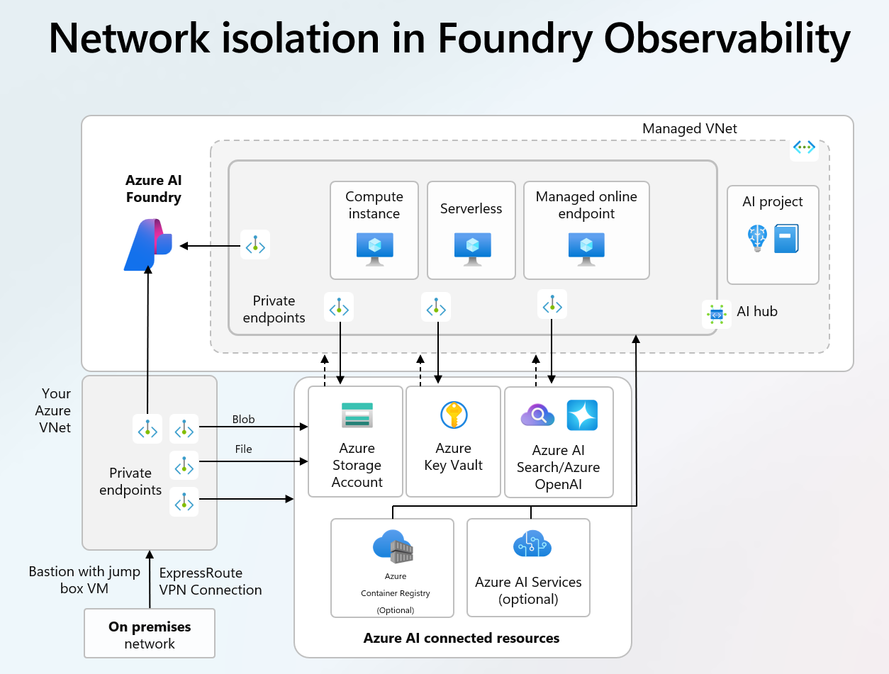

# AI Foundry Classic Basic — Hub-Spoke + Managed VNet

Classic AI Foundry Hub를 **Spoke VNet + Hub VNet Peering + Managed VNet** 구성으로 배포하여 E2E Private Networking을 구성합니다.

기본적인 RAG 를 위해 AI Search Vector Search 예제기반: https://github.com/Azure-Samples/azure-search-openai-demo

## 아키텍처

### 추상 아키텍처




### 구성 아키텍처
```
┌─────────────────────────────┐
│  On-prem VNet (172.16.0.0)  │
│  ┌───────────┐              │
│  │ Windows   │ ◄── RDP      │
│  │ Jumpbox   │              │
│  └─────┬─────┘              │
└────────┼────────────────────┘
         │ VNet Peering (Hub + Spoke 직접)
         │
┌────────┼─────────────────────┐
│  Hub VNet (10.0.0.0/16)      │
│  ├── GatewaySubnet           │
│  └── snet-shared-services    │
└────────┼─────────────────────┘
         │ VNet Peering
┌────────┼──────────────────────────────────────────────┐
│  Spoke VNet (10.1.0.0/16)                             │
│  └── snet-privateendpoints                            │
│      ├── PE: Storage (blob)                           │
│      ├── PE: Storage (file)                           │
│      ├── PE: Key Vault                                │
│      └── PE: OpenAI                                   │
│  ┌─ Private DNS Zones ──────────────────────────────┐ │
│  │ privatelink.blob.core.windows.net                │ │
│  │ privatelink.file.core.windows.net                │ │
│  │ privatelink.vaultcore.azure.net                  │ │
│  │ privatelink.cognitiveservices.azure.com          │ │
│  │ privatelink.openai.azure.com                     │ │
│  └──────────────────────────────────────────────────┘ │
│  ※ DNS Zones는 Spoke VNet + Jumpbox VNet 모두에 링크   │
└───────────────────────────────────────────────────────┘

※ VNet Peering은 transitive하지 않음:
  Jumpbox→Hub→Spoke 경로로는 Spoke PE에 접근 불가
  → Jumpbox↔Spoke 직접 Peering 필수

         │ 리소스 연결
┌────────┼──────────────────────────────────────────────┐
│  AI Foundry Resources                                 │
│  ┌──────────────────────────────────────────────────┐ │
│  │            Managed VNet (Hub 자동 관리)           │ │
│  │  ┌──────────┐ ┌──────────┐ ┌──────────────────┐  │ │
│  │  │ Compute  │ │Serverless│ │ Managed Online   │  │ │
│  │  │ Instance │ │          │ │ Endpoint         │  │ │
│  │  └──────────┘ └──────────┘ └──────────────────┘  │ │
│  └──────────────────────────────────────────────────┘ │
│              ┌──────────┐                             │
│              │  AI Hub  │──── AI Project              │
│              └──────┬───┘                             │
│        ┌────────────┼────────────┐                    │
│   ┌────▼────┐ ┌─────▼─────┐ ┌───▼──────┐              │
│   │ Storage │ │ Key Vault │ │  OpenAI  │              │
│   │ Account │ │           │ │ (GPT-4o) │              │
│   └─────────┘ └───────────┘ └──────────┘              │
└───────────────────────────────────────────────────────┘
```


## 배포 방법

### 방법 1: Bicep (IaC)

```bash
# 1. Hub VNet 생성 (최초 1회)
./scripts/setup-hub-spoke.sh --location koreacentral --env dev

# 2. Basic 배포
export HUB_VNET_ID=$(az network vnet show -g rg-aif-hub-krc-dev \
  -n vnet-hub-dev --query id -o tsv)
cd infra-foundry-classic/basic
az deployment sub create --location swedencentral \
  --template-file main.bicep --parameters parameters/dev.bicepparam

# 3. (선택) Jumpbox 배포
cd ../jumpbox
export ADMIN_PASSWORD='<비밀번호>'
az deployment sub create --location koreacentral \
  --template-file main.bicep --parameters parameters/dev.bicepparam
```

### 방법 2: Azure Portal (수동)

아래 단계를 순서대로 진행합니다.

> **사전 조건**: Hub VNet(`rg-aif-hub-krc-ui`)이 이미 생성되어 있어야 합니다. `scripts/setup-hub-spoke.sh --location koreacentral --env ui`로 생성하거나, Portal에서 별도로 만드세요.

---

#### Step 1. 리소스 그룹 생성

> **참고**: 이미 사용 중인 리소스 그룹이 있다면 이 단계를 생략하고 기존 리소스 그룹을 사용할 수 있습니다.

1. Azure Portal → **Resource groups** → **Create**
2. 설정:
   - **Subscription**: 사용할 구독 선택
   - **Resource group name**: `rg-aif-classic-basic-swc-ui`
   - **Region**: `(Europe) Sweden Central`

3. **Review + create** → **Create**

---

#### Step 2. Spoke VNet 생성

1. Azure Portal → **Create a resource** → **Virtual network** 검색 → **Create**
2. **Basics** 탭:
   - **Resource group**: `rg-aif-classic-basic-swc-ui`
   - **Virtual network name**: `vnet-aifoundry-classic-ui`
   - **Region**: `Sweden Central`
3. **IP Addresses** 탭:
   - **IPv4 address space**: `10.2.0.0/16` (dev 환경이 10.1.x를 사용 중이면 겹치지 않도록 변경)
   - **+ Add a subnet**:
     - **Subnet name**: `snet-privateendpoints`
     - **Starting address**: `10.2.1.0`
     - **Subnet size**: `/24` (256 addresses)
4. **Review + create** → **Create**

---

#### Step 3. Hub VNet과 Peering 구성

양방향 Peering을 설정합니다. **Jumpbox↔Spoke 직접 Peering도 필수**입니다.

##### 3-1. Spoke → Hub Peering

1. 생성된 Spoke VNet (`vnet-aifoundry-classic-ui`) → **Settings** → **Peerings**
2. **+ Add**
3. **Remote virtual network summary** 설정:
   - **Peering link name**: `peer-spoke-to-hub-ui`
   - **Subscription**: 사용할 구독 선택
   - **Virtual network**: Hub VNet 선택 (`vnet-hub-dev` in `rg-aif-hub-krc-dev`)
4. **Remote virtual network peering settings**:
   - **Allow 'vnet-hub-dev' to access 'vnet-aifoundry-classic-ui'**: ✅ 체크
   - 나머지 옵션은 기본값 유지
5. **Local virtual network summary**:
   - **Peering link name**: `peer-hub-to-classic-basic-ui`
6. **Local virtual network peering settings**:
   - **Allow 'vnet-aifoundry-classic-ui' to access 'vnet-hub-dev'**: ✅ 체크
   - 나머지 옵션은 기본값 유지
7. **Add**


##### 3-2. Spoke ↔ Jumpbox Peering (필수)

> **왜 필요한가?** VNet Peering은 transitive하지 않습니다.
> Jumpbox→Hub→Spoke 경로로는 Spoke의 Private Endpoint IP에 도달할 수 없습니다.
> Jumpbox에서 AI Foundry Portal에 접속하려면 Spoke VNet과 직접 Peering이 필수입니다.

1. Spoke VNet → **Settings** → **Peerings** → **+ Add**
2. **Remote virtual network summary**:
   - **Peering link name**: `peer-spoke-to-jumpbox`
   - **Virtual network**: Jumpbox VNet 선택 (`vnet-onprem-dev`)
3. **Local virtual network summary**:
   - **Peering link name**: `peer-jumpbox-to-spoke`
4. 양쪽 모두 **Allow access**: ✅ 체크
5. **Add**

> 모든 Peering 상태가 **Connected**인지 확인하세요.

---

#### Step 4. Storage Account 생성

1. Azure Portal → **Create a resource** → **Storage account**
2. **Basics** 탭:
   - **Resource group**: `rg-aif-classic-basic-swc-ui`
   - **Storage account name**: 고유 이름 (예: `stcxxxxxxxx`, 24자 이하)
   - **Region**: `Sweden Central`
   - **Performance**: `Standard`
   - **Redundancy**: `Zone-redundant storage (ZRS)`
3. **Advanced** 탭:
   - **Require secure transfer**: ✅ 체크
   - **Allow enabling anonymous access on individual containers**: ❌ 해제
   - **Enable storage account key access**: ✅ 체크 (Hub 내부 동작에 필요)
   - **Minimum TLS version**: `Version 1.2`
4. **Review + create** → **Create**

---

#### Step 5. Key Vault 생성

1. Azure Portal → **Create a resource** → **Key Vault**
2. **Basics** 탭:
   - **Resource group**: `rg-aif-classic-basic-swc-ui`
   - **Key vault name**: 고유 이름 (예: `kv-xxxxxxxx`)
   - **Region**: `Sweden Central`
   - **Pricing tier**: `Standard`
3. **Access configuration** 탭:
   - **Permission model**: `Azure role-based access control (recommended)` 선택
4. **Networking** 탭:
   - **Network connectivity**: `All networks` (초기 배포 시)
5. **Review + create** → **Create**

---

#### Step 6. Azure OpenAI 리소스 생성

1. Azure Portal → **Create a resource** → **Azure OpenAI** 검색 → **Create**
2. **Basics** 탭:
   - **Resource group**: `rg-aif-classic-basic-swc-ui`
   - **Region**: `Sweden Central`
   - **Name**: 고유 이름 (예: `oai-xxxxxxxx`)
   - **Pricing tier**: `Standard S0`
3. **Networking** 탭:
   - **Type**: `All networks` (초기 배포 시)
4. **Review + submit** → **Create**

##### 6-1. 모델 배포 (Azure AI Studio에서)

1. 생성된 OpenAI 리소스 → **Go to Azure AI Studio** 또는 **Model deployments**
2. **Create deployment**:
   - **Model**: `gpt-4o`
   - **Deployment name**: `gpt-4o`
   - **Deployment type**: `Global Standard`
   - **Tokens per Minute Rate Limit**: `10K`
3. 동일하게 추가 배포:
   - **Model**: `text-embedding-ada-002`
   - **Deployment name**: `text-embedding-ada-002`
   - **Deployment type**: `Global Standard`

---

#### Step 7. AI Foundry Hub 생성 (핵심)

1. Azure Portal → **Create a resource** → **Azure AI Foundry** 검색 → **Create**
2. **"Hub"** 리소스 선택 (Foundry 리소스가 아님)
3. **Basics** 탭:
   - **Resource group**: `rg-aif-classic-basic-swc-ui`
   - **Hub name**: 고유 이름 (예: `hub-xxxxxxxx`)
   - **Region**: `Sweden Central`
   - **Storage account**: Step 4에서 생성한 Storage Account 선택
   - **Key vault**: Step 5에서 생성한 Key Vault 선택
4. **Networking** 탭:
   - **Network isolation**: `Private with Internet Outbound` 선택
     - 이것이 `AllowInternetOutbound` Managed VNet 모드입니다
   - Hub가 Storage, Key Vault에 대한 Private Endpoint를 자동 생성합니다
5. **Review + create** → **Create**

> ⚠️ **중요**: Hub 생성에 5~10분 소요될 수 있습니다. Managed VNet 프로비저닝이 백그라운드에서 진행됩니다.

---

#### Step 8. Hub에 OpenAI 연결 추가

1. 생성된 Hub → **Settings** → **Connected resources**
2. **+ Add connection**
3. 설정:
   - **Connection type**: `Azure OpenAI`
   - **Authentication**: `Microsoft Entra ID`
   - Step 6에서 생성한 OpenAI 리소스 선택
4. **Add**

---

#### Step 9. AI Project 생성

1. Hub 내에서 → **+ New project**
2. 설정:
   - **Project name**: (예: `proj-xxxxxxxx`)
3. **Create**

---

#### Step 10. RBAC 역할 할당

Hub/Project의 System Assigned Managed Identity와 사용자에게 다음 역할을 할당합니다:

1. Hub 리소스 → **Identity** → **System assigned** → Object ID 복사
2. Project 리소스 → **Identity** → **System assigned** → Object ID 복사
3. 각 리소스에서 **Access control (IAM)** → **Add role assignment**:

##### OpenAI 리소스 (`oai-xxxxxxxx`)

| 역할 | 할당 대상 | 용도 |
|------|----------|------|
| `Cognitive Services OpenAI Contributor` | Hub MI | Hub에서 OpenAI 모델 접근 |
| `Cognitive Services OpenAI Contributor` | Project MI | Project에서 모델 배포/추론 |
| `Cognitive Services OpenAI User` | 사용자 (본인) | Playground/SDK 테스트 |
| `Cognitive Services OpenAI User` | AI Search MI | Search vectorizer에서 임베딩 생성 |

##### Storage Account (`stcxxxxxxxx`)

| 역할 | 할당 대상 | 용도 |
|------|----------|------|
| `Storage Blob Data Contributor` | Hub MI | Hub 내부 데이터 접근 |
| `Storage Blob Data Owner` | Project MI | Project 파일 관리 |
| `Storage Blob Data Contributor` | 사용자 (본인) | RAG 문서 업로드 |
| `Storage Blob Data Reader` | AI Search MI | Knowledge 인덱싱 시 Blob 읽기 |
| `Storage File Data Privileged Contributor` | Hub MI | Identity 기반 인증 시 File Share 접근 |
| `Storage File Data Privileged Contributor` | Project MI | Identity 기반 인증 시 File Share 접근 |
| `Storage File Data Privileged Contributor` | 사용자 (본인) | Identity 기반 인증 시 File Share 접근 |

##### Key Vault (`kv-xxxxxxxx`)

| 역할 | 할당 대상 | 용도 |
|------|----------|------|
| `Key Vault Administrator` | Hub MI | 비밀/키 관리 |

##### AI Search (`srch-xxxxxxxx`) — RAG 사용 시

| 역할 | 할당 대상 | 용도 |
|------|----------|------|
| `Search Index Data Contributor` | Hub MI | 인덱스 데이터 읽기/쓰기 |
| `Search Index Data Contributor` | Project MI | Agent에서 검색 |
| `Search Index Data Contributor` | 사용자 (본인) | RAG 인덱싱 스크립트 |
| `Search Service Contributor` | Hub MI | 인덱스 생성/관리 |
| `Search Service Contributor` | Project MI | 인덱스 관리 |
| `Search Service Contributor` | 사용자 (본인) | 인덱스 생성 스크립트 |

##### Cosmos DB (`cosmos-xxxxxxxx`) — Agent 사용 시

| 역할 | 할당 대상 | 용도 |
|------|----------|------|
| `Cosmos DB Operator` | Hub MI | 데이터베이스 관리 |
| `Cosmos DB Operator` | Project MI | 스레드 저장 |
| Cosmos DB Built-in Data Contributor (SQL RBAC) | Hub MI | 데이터 읽기/쓰기 |
| Cosmos DB Built-in Data Contributor (SQL RBAC) | Project MI | 데이터 읽기/쓰기 |

> **참고**: AI Search와 Cosmos DB는 RAG/Agent 기능 사용 시에만 필요합니다.
> AI Search MI에도 System Identity를 활성화하고 OpenAI User RBAC를 부여해야 integrated vectorizer가 동작합니다.

---

#### Step 11. Private Endpoint 생성 (Spoke VNet 연결)

각 리소스에 대해 Spoke VNet의 PE 서브넷에 Private Endpoint를 생성합니다.

1. 각 리소스 → **Networking** → **Private endpoint connections** → **+ Private endpoint**
2. 공통 설정:
   - **Resource group**: `rg-aif-classic-basic-swc-ui`
   - **Region**: `Sweden Central`
   - **Virtual network**: `vnet-aifoundry-classic-ui`
   - **Subnet**: `snet-privateendpoints`
   - **Integrate with private DNS zone**: `Yes`

| 리소스 | Sub-resource | DNS Zone |
|--------|-------------|----------|
| Storage Account | `blob` | `privatelink.blob.core.windows.net` |
| Storage Account | `file` | `privatelink.file.core.windows.net` |
| Key Vault | `vault` | `privatelink.vaultcore.azure.net` |
| OpenAI | `account` | `privatelink.cognitiveservices.azure.com` |

---

#### Step 12. Knowledge Base 생성 (RAG 구성)

AI Search에 문서를 인덱싱하여 RAG 검색을 구성합니다. Portal의 Knowledge 기능을 사용하면 로컬 스크립트 없이 자동으로 청킹 + 임베딩 + 벡터 인덱스가 생성됩니다.

> **사전 조건**: AI Search MI에 `Storage Blob Data Reader` RBAC가 필요합니다 (Step 10 참고).

1. AI Foundry Portal → Project 선택 → **Knowledge** (또는 **Data + indexes**)
2. **+ Create knowledge base**
3. **Basics**:
   - **Name**: 의미 있는 이름 (예: `northwind-hr-kb`)
   - **Description**:
     ```
     Northwind 직원 복리후생 문서 기반 Knowledge Base.
     Benefit_Options, PerksPlus, Health Plus/Standard 보험, 직원 핸드북, 역할 가이드 포함.
     azure-search-openai-demo 예제 기반.
     ```
   - **Knowledge sources**: **Create new** → Storage의 `rag-documents` 컨테이너 선택
4. **Retrieval**:
   - **Reasoning effort**: `Medium`
   - **Retrieval instructions**:
     ```
     사용자의 질문에 가장 관련성 높은 문서를 검색합니다.
     질문이 한국어이면 한국어와 영어 모두에서 검색하세요.
     다음 문서 유형을 우선 검색하세요:
     - 보험/혜택 관련: Northwind_Health_Plus_Benefits_Details.pdf, Northwind_Standard_Benefits_Details.pdf, Benefit_Options.pdf
     - 복지/피트니스 관련: PerksPlus.pdf
     - 회사 정책/규정: employee_handbook.pdf, role_library.pdf
     - 회사 개요: Zava_Company_Overview.md
     검색 결과에 반드시 소스 파일명을 포함하세요.
     ```
   - **Chat completion model**: `gpt-4o` 배포 추가
6. **Output configurations**:
   - **Output mode**: `Answer synthesis`
   - **Answer instructions**:
     ```
     검색된 소스 문서를 기반으로만 답변하세요.
     각 답변에 사용한 소스 파일명을 [brackets]로 인용하세요 (예: [PerksPlus.pdf]).
     소스가 없으면 "관련 문서를 찾을 수 없습니다"라고 답하세요.
     질문이 한국어이면 한국어로 답변하세요.
     답변 끝에 3개의 후속 질문을 제안하세요.
     ```
7. **Save**

> Portal이 자동으로 문서 추출 → 청킹 → 임베딩(text-embedding-ada-002) → AI Search 벡터 인덱스 생성을 수행합니다.

---

## Bicep vs Portal 대응 관계

| Bicep 모듈 | Portal 단계 | 비고 |
|------------|-----------|------|
| `networking/main.bicep` → VNet | Step 2~3 | Spoke VNet + Hub Peering |
| `dependent-resources/main.bicep` → Storage | Step 4 | `allowSharedKeyAccess: true` |
| `dependent-resources/main.bicep` → Key Vault | Step 5 | RBAC 인증 |
| `ai-foundry/main.bicep` → OpenAI Account | Step 6 | GPT-4o + Embedding |
| `ai-foundry/main.bicep` → AI Hub | Step 7 | Managed VNet 핵심 |
| `ai-foundry/main.bicep` → Connection | Step 8 | AAD 인증 |
| `ai-foundry/main.bicep` → AI Project | Step 9 | Hub 하위 |
| `ai-foundry/main.bicep` → RBAC | Step 10 | 3개 역할 |
| `private-endpoints/main.bicep` → PE | Step 11 | 4개 PE |

> **참고**: Private DNS Zone은 Step 11의 PE 생성 시 **Integrate with private DNS zone: Yes**를 선택하면 자동 생성됩니다.
> Bicep에서는 `networking/main.bicep`에서 별도로 생성합니다.
> DNS Zone은 Spoke VNet + Jumpbox VNet 양쪽에 링크해야 Jumpbox에서 DNS 해석이 됩니다.

## 배포 후 확인

- Hub → **Networking** → Managed VNet 상태가 `Active`인지 확인
- Hub → **Connected resources** → Storage, Key Vault, OpenAI 모두 연결 상태 확인
- **Spoke VNet → Peerings** → Hub VNet, Jumpbox VNet 모두 `Connected` 상태 확인
- **Jumpbox VNet → Peerings** → Hub VNet, Spoke VNet 모두 `Connected` 상태 확인
- Private Endpoints → 각 PE 상태가 `Approved` 인지 확인
- Project에서 Chat playground 접속 → GPT-4o 모델 테스트

> **⚠️ VNet Peering 주의**: VNet Peering은 transitive하지 않습니다.
> Jumpbox→Hub→Spoke 경로로는 Spoke VNet의 Private Endpoint에 접근할 수 없으므로,
> **Jumpbox VNet ↔ Spoke VNet 직접 Peering이 반드시 필요**합니다.
> Bicep 코드에서 `jumpboxVnetId`, `jumpboxVnetResourceGroup`, `jumpboxVnetName` 파라미터로 자동 구성됩니다.

## 배포 후 보안 강화 (선택)

Managed VNet PE + Spoke VNet PE 프로비저닝이 완료되면, 종속 리소스의 public access를 비활성화할 수 있습니다:

```bash
RG="rg-aif-classic-basic-swc-ui"

# Storage
az storage account update --name <storage-name> --resource-group $RG \
  --public-network-access Disabled

# Key Vault
az keyvault update --name <kv-name> --resource-group $RG \
  --public-network-access Disabled

# OpenAI
az cognitiveservices account update --name <oai-name> --resource-group $RG \
  --public-network-access Disabled
```

## 리소스 삭제

```bash
az group delete --name rg-aif-classic-basic-swc-ui --yes
# OpenAI soft-delete 정리
az cognitiveservices account purge --name <oai-name> \
  --resource-group rg-aif-classic-basic-swc-ui --location swedencentral
```

## Troubleshooting

### "Error loading Microsoft Foundry project" — 네트워크 차단 오류

**증상**: `ai.azure.com`에서 프로젝트 선택 시 "You are attempting to access a restricted resource from an unauthorized network location" 오류 발생.

**원인**: Hub의 `publicNetworkAccess: Disabled` 설정 시, public DNS에서 `privatelink` CNAME 전환에 시간이 필요합니다.

**진단 (Jumpbox PowerShell)**:

```powershell
# 1. Private DNS Zone 직접 조회 — 10.1.x.x가 나오면 PE/DNS 정상
nslookup <workspace-id>.workspace.swedencentral.privatelink.api.azureml.ms

# 2. Public DNS 조회 — privatelink CNAME으로 전환되었는지 확인
nslookup <hub-name>.workspace.swedencentral.api.azureml.ms
```

- **1번에서 10.1.x.x 나옴, 2번에서 public IP 나옴** → Public DNS CNAME 전파 대기 중 (최대 30분~1시간)
- **1번에서도 실패** → PE 또는 DNS Zone 구성 문제

**해결**:
1. `publicNetworkAccess: Disabled` 전환 후 DNS 전파를 기다립니다 (30분~1시간)
2. Jumpbox에서 `ipconfig /flushdns` 후 재시도
3. 전파 완료 후 `nslookup`에서 private IP가 나오면 `ai.azure.com` 접속 가능

### Hub publicNetworkAccess 전환

Hub 초기 배포 시 `Enabled`로 배포하고, Managed VNet PE 프로비저닝 완료 후 `Disabled`로 전환합니다:

```bash
# Disabled로 전환
az resource update \
  --ids $(az resource show --resource-group <rg-name> --name <hub-name> \
    --resource-type Microsoft.MachineLearningServices/workspaces --query id -o tsv) \
  --set properties.publicNetworkAccess=Disabled

# 상태 확인
az resource show --resource-group <rg-name> --name <hub-name> \
  --resource-type Microsoft.MachineLearningServices/workspaces \
  --query properties.publicNetworkAccess -o tsv
```

### DNS 해석 실패 (Non-existent domain)

**증상**: Jumpbox에서 `nslookup hub-xxx.api.azureml.ms` → `Non-existent domain`

**원인**: ML workspace FQDN은 `hub-xxx.api.azureml.ms`가 아니라 `hub-xxx.workspace.swedencentral.api.azureml.ms` 형식입니다.

**해결**: 올바른 FQDN으로 조회:
```powershell
nslookup <hub-name>.workspace.swedencentral.api.azureml.ms
```

### Key Vault / OpenAI soft-delete 충돌

**증상**: 재배포 시 "A vault with the same name already exists in deleted state" 또는 "soft-deleted" 오류

**해결**:
```bash
# Key Vault purge
az keyvault purge --name <kv-name> --location swedencentral

# OpenAI purge
az cognitiveservices account purge --name <oai-name> \
  --resource-group <rg-name> --location swedencentral
```
