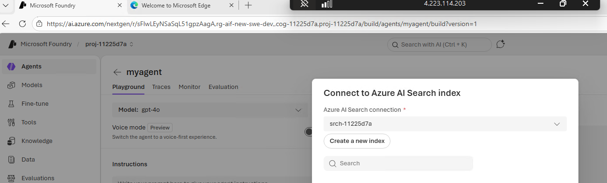

# Standard Agent Setup (BYO VNet + Private Networking)

Standard Agent Setup은 **BYO VNet(Bring Your Own Virtual Network)** 기반 **프라이빗 네트워크** 환경에서 Foundry Agent Service를 운영합니다.

## 개요

BYO VNet(Bring Your Own Virtual Network) + Private Endpoint 기반의 **Network Injection** 구성으로, 모든 트래픽이 Microsoft 백본 네트워크를 통해 전달됩니다. Agent 서브넷에 `Microsoft.App/environments` 위임을 통해 컨테이너 런타임이 고객 VNet 내부에 주입(Container Injection)되며, 모든 리소스는 Private Endpoint로만 접근 가능합니다.

> **참고**: Azure Portal의 Networking > Network Injection 탭에서 "Managed virtual network"는 별도 Preview 기능(Azure가 VNet을 완전 관리)이며, 본 템플릿과 무관합니다. 본 템플릿은 **Standard Agent service network injection** (BYO VNet + subnet delegation) 방식을 사용합니다.

**Hub-Spoke 토폴로지**를 지원하여 기존 Hub VNet과 연결할 수 있습니다.

Bicep 템플릿이 **networkInjections** (Account 수준)과 **Capability Host** (Project 수준)를 자동으로 배포하므로, Portal에서 수동으로 Agent Setup을 구성할 필요가 없습니다.



### 리전 지원

> **참고**: 본 템플릿은 `10.0.0.0/16` (Class A) 서브넷을 사용합니다. Class A 주소 대역은 다음 19개 리전에서 GA 지원됩니다: Australia East, Brazil South, Canada East, East US, East US 2, France Central, Germany West Central, Italy North, Japan East, South Africa North, South Central US, South India, Spain Central, Sweden Central, UAE North, UK South, West Europe, West US, West US 3.

#### Private Networking 서브넷 지원 현황

| 서브넷 클래스 | 주소 범위 | 지원 리전 | 상태 |
|--------------|----------|----------|------|
| **Class B/C** | `172.16.0.0/12`, `192.168.0.0/16` | 모든 Agent Service 지원 리전 | **GA** |
| **Class A** | `10.0.0.0/8` | 위 19개 리전만 | **GA** |

> 기존 VNet이 `10.0.0.0/8` 대역을 사용하는 경우, 위 리전에서만 배포 가능합니다. 

#### Bing Search Grounding 지원 리전 (선택 기능)

Agent에서 Bing Search tool 사용 시 다음 리전에서만 지원됩니다:
Australia East, Brazil South, Canada Central, Canada East, Central US, East US, East US 2, France Central, Italy North, Japan East, Korea Central, Norway East, Poland Central, South Africa North, South India, Southeast Asia, Spain Central, Sweden Central, Switzerland North, UAE North, UK South, West Europe, West US, West US 2, West US 3

### 배포되는 리소스

| 카테고리 | 리소스 | 비고 |
|----------|--------|------|
| **네트워크** | VNet, Subnets (3개), NSGs | 10.0.0.0/16 |
| **Hub-Spoke** | VNet Peering (양방향), DNS Zone Hub Link | 선택적 |
| **Private DNS Zones** | 7개 | cognitiveservices, openai, services.ai, search, documents, blob, file |
| **AI Foundry** | Account (networkInjections), Project | kind=AIServices |
| **Capability Host** | Project Capability Host (Agents) | Network Injection 자동 구성 |
| **모델 배포** | GPT-4o, text-embedding-3-large | GlobalStandard SKU |
| **의존 서비스** | Storage, Cosmos DB, AI Search | Private Endpoint 연결 |
| **Private Endpoints** | 5개 | foundry, storage-blob, storage-file, cosmos, search |
| **RBAC** | 13개 역할 할당 | 아래 RBAC 섹션 참조 |
| **Jumpbox** (선택) | Windows VM + Public IP | VNet 내부 접속용 (RDP) |

### 아키텍처

```
┌─────────────────────────────────────────────────────────────────┐
│                 Hub VNet (10.0.0.0/16) [선택]                  │
│     ※ setup-hub-spoke.sh로 사전 생성                           │
│                                                                 │
│  ┌─────────────────────────────────────────────────────────┐   │
│  │  GatewaySubnet / SharedSubnet                           │   │
│  └─────────────────────────────────────────────────────────┘   │
└──────────────────────────┬──────────────────────────────────────┘
                           │ VNet Peering (양방향)
┌──────────────────────────┴──────────────────────────────────────┐
│            Spoke VNet (10.0.0.0/16)                             │
│                                                                 │
│  ┌─────────────────────────────────────────────────────────┐   │
│  │  Agent Subnet (10.0.0.0/24)                             │   │
│  │  - Microsoft.App/environments 위임                      │   │
│  │  - Capability Host가 Agent 런타임 프로비저닝             │   │
│  └─────────────────────────────────────────────────────────┘   │
│  ┌─────────────────────────────────────────────────────────┐   │
│  │  Private Endpoint Subnet (10.0.1.0/24)                  │   │
│  │  - Foundry, Storage (blob/file), Cosmos DB, AI Search   │   │
│  └─────────────────────────────────────────────────────────┘   │
│  ┌─────────────────────────────────────────────────────────┐   │
│  │  Jumpbox Subnet (10.0.2.0/24) [선택]                    │   │
│  │  - Windows VM + Public IP (RDP)                         │   │
│  └─────────────────────────────────────────────────────────┘   │
└─────────────────────────────────────────────────────────────────┘
```

## RBAC 역할 할당 (13개)

모든 역할은 **System Assigned Managed Identity** 기반으로 자동 할당됩니다.

### Azure RBAC (관리 플레인)

| 리소스 | 역할 | Role ID | Account | Project | 용도 |
|--------|------|---------|:-------:|:-------:|------|
| **Storage** | Storage Blob Data Owner | `b7e6dc6d-f1e8-4753-8033-0f276bb0955b` | ✅ | ✅ | Blob 컨테이너/데이터 완전 제어 |
| **Storage** | Storage Blob Data Contributor | `ba92f5b4-2d11-453d-a403-e96b0029c9fe` | ✅ | ✅ | Agent 파일 읽기/쓰기 |
| **Storage** | Storage Queue Data Contributor | `974c5e8b-45b9-4653-ba55-5f855dd0fb88` | - | ✅ | Azure Function tool 지원 |
| **Cosmos DB** | Cosmos DB Operator | `230815da-be43-4aae-9cb4-875f7bd000aa` | ✅ | ✅ | DB/컨테이너 관리(관리 플레인) |
| **AI Search** | Search Index Data Contributor | `8ebe5a00-799e-43f5-93ac-243d3dce84a7` | ✅ | ✅ | 인덱스 데이터 읽기/쓰기 |
| **AI Search** | Search Service Contributor | `7ca78c08-252a-4471-8644-bb5ff32d4ba0` | ✅ | ✅ | 인덱스/데이터 소스 관리 |
| **Cognitive Services** | OpenAI Contributor | `a001fd3d-188f-4b5d-821b-7da978bf7442` | - | ✅ | 모델 호출 권한 |

### Cosmos DB 데이터 플레인 RBAC

> **중요**: Azure RBAC의 `Cosmos DB Operator`는 **관리 플레인**만 커버합니다. Agent가 실제 데이터를 읽고 쓰려면 Cosmos DB **자체 데이터 플레인 역할**이 추가로 필요합니다.

| 역할 | Role Definition ID | Account | Project | 용도 |
|------|-------------------|:-------:|:-------:|------|
| Cosmos DB Built-in Data Contributor | `00000000-0000-0000-0000-000000000002` | ✅ | ✅ | 데이터 CRUD (threads, messages 등) |

이 역할은 `az cosmosdb sql role assignment create` 또는 Bicep의 `Microsoft.DocumentDB/databaseAccounts/sqlRoleAssignments`로 할당합니다. Azure Portal의 IAM 탭에서는 보이지 않습니다.

### 배포자 필요 권한

배포를 수행하는 사용자에게 다음 권한이 필요합니다:

| 역할 | 범위 | 용도 |
|------|------|------|
| **Azure AI Account Owner** | Subscription | Foundry Account/Project 생성 |
| **Owner** 또는 **Role Based Access Administrator** | Subscription | RBAC 역할 할당 (`Microsoft.Authorization/roleAssignments/write`) |

## 배포 방법

### 방법 1: Bicep 템플릿

**Standalone VNet:**
```bash
cd infra-foundry-new/standard/basic

az deployment sub create \
  --location swedencentral \
  --template-file main.bicep \
  --parameters parameters/dev.bicepparam
```

**Hub-Spoke 구성:**
```bash
# 0. Hub VNet 사전 생성
./scripts/setup-hub-spoke.sh --location swedencentral --env dev

# 1. Hub VNet ID 조회
HUB_VNET_ID=$(az network vnet show \
  -g rg-aif-hub-swc-dev -n vnet-hub-dev --query id -o tsv)

# 2. Hub-Spoke 포함 배포
cd infra-foundry-new/standard/basic
az deployment sub create \
  --location swedencentral \
  --template-file main.bicep \
  --parameters parameters/dev.bicepparam \
  --parameters hubVnetId="${HUB_VNET_ID}" \
               hubVnetResourceGroup='rg-aif-hub-swc-dev' \
               hubVnetName='vnet-hub-dev'
```

### 방법 2: az cli 스크립트 (단일 파일)

```bash
# 기본 배포 (Sweden Central, dev)
./scripts/deploy-standard-agent.sh

# 리전/환경 지정
./scripts/deploy-standard-agent.sh --location eastus --env prod

# Jumpbox 포함
./scripts/deploy-standard-agent.sh --jumpbox --jumpbox-password 'YourP@ssw0rd!'
```

배포 시간: 약 15-20분

## 배포 후 동작 확인

1. [Azure AI Foundry Portal](https://ai.azure.com) 접속
2. Bicep으로 배포된 Project (`proj-xxxxxxxx`) 선택
3. 좌측 메뉴 **에이전트(Agents)** 클릭
4. **+ 새 에이전트(New Agent)** 클릭
5. 모델 선택: `gpt-4o`
6. 시스템 프롬프트 입력 후 테스트 메시지 전송
7. 응답이 정상적으로 반환되면 배포 완료

## 배포 검증

```bash
./scripts/verify-deployment.sh rg-aif-new-swc-dev
```

## Jumpbox 옵션

> **📌 Note**: Jumpbox는 **Private Networking 환경에서 고객의 온프레미스 PC 환경을 재현(시뮬레이션)** 하기 위해 구성합니다. 실제 프로덕션에서는 ExpressRoute, VPN Gateway 등으로 대체됩니다.

VNet 내부 리소스에 접근하려면 Jumpbox가 필요합니다.

```bash
# Jumpbox 포함 배포 (Bicep)
az deployment sub create \
  --location swedencentral \
  --template-file main.bicep \
  --parameters parameters/dev.bicepparam \
  --parameters deployJumpbox=true \
               jumpboxAdminPassword='YourP@ssw0rd!'
```

## 삭제

```bash
# 1. 리소스 그룹 삭제
az group delete --name rg-aif-new-swc-dev --yes

# 2. Cognitive Services Purge (필수 - 안 하면 재배포 시 subnet 충돌)
az cognitiveservices account purge \
  --name <account-name> \
  --resource-group rg-aif-new-swc-dev \
  --location swedencentral
```

## 트러블슈팅

| 오류 | 원인 | 해결 |
|------|------|------|
| Cosmos DB 403 / Substatus 5301 | `Cosmos DB Operator`는 관리 플레인만 커버 | `Cosmos DB Built-in Data Contributor` 데이터 플레인 역할 추가 |
| Windows VM computerName 15자 초과 | `az vm create`에서 VM name이 computerName으로 사용됨 | `--computer-name` 파라미터로 15자 이내 이름 명시 |
| Capability Host 실패 | Connection 3개(storage, cosmos, search) 중 하나라도 누락 | 모든 BYO 리소스 연결 필수 |
| Subnet already in use | 이전 배포 삭제 후 purge 미수행 | `az cognitiveservices account purge` 실행 후 20분 대기 |
| 10.x.x.x 서브넷 오류 | Class A 미지원 리전에서 배포 시도 | 19개 지원 리전 확인 또는 192.168.x.x로 변경 |
